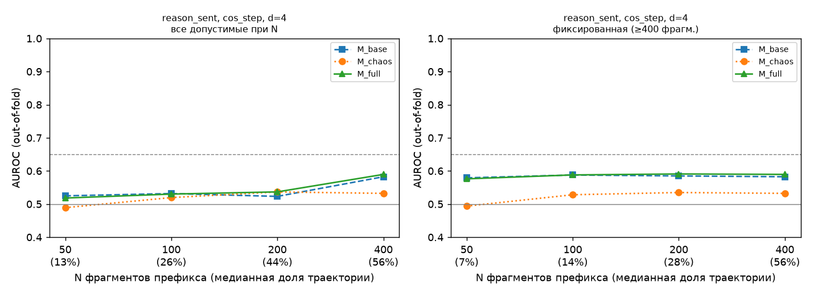

# E4 — результаты статистических тестов (main)

Модели: StandardScaler + логистическая регрессия (L2, C=1), без подбора гиперпараметров. Кросс-валидация: 5 фолдов, группировка по task_id (единая карта `outputs/folds.csv`). AUROC, PR-AUC и precision@10% считаются внутри каждого фолда и усредняются: объединение предсказаний разных фолдов смещает AUROC вниз (у модели каждого фолда свой свободный член, который сдвигается против доли провалов в тестовом фолде); объединённый AUROC для справки есть в summary.csv. ДИ — перцентильный бутстрэп по задачам внутри фолдов, 1000 повторов, seed 42.

## Главный ответ

Критерий успеха темы (AGENTS.md): нижняя граница 95% ДИ прироста AUROC (M_full − M_base) > 0.

**1. Заранее заданная основная комбинация** `('reason_sent', 'cos_step', 200, 4)` (n = 6673, задач 500):
AUROC base = 0.523, chaos = 0.537, full = 0.537; Δ = 0.014 [95% ДИ -0.004; 0.031] → критерий **НЕ выполнен**.

**2. Вложенный выбор комбинации** (правило 4.1: комбинация выбирается в каждом внешнем фолде по внутренней CV только на обучающих фолдах; кандидаты — основная сетка AGENTS.md: seg ∈ ('reason_sent', 'all_sent'), N ∈ (100, 200, 400), все proj и d, всего 48 комбинаций; n = 6955):
AUROC base = 0.526, chaos = 0.538, full = 0.537; Δ = 0.010 [95% ДИ -0.007; 0.028] → критерий **НЕ выполнен**.
Выбранные комбинации по внешним фолдам: ('reason_sent', 'pca1', 200, 4) ×4; ('all_sent', 'pca1', 100, 4) ×1.

*Проверка чувствительности (не ответ):* тот же вложенный выбор, но из всех 88 комбинаций, включая контрольные seg=step и N=50. Выбранные: ('step', 'cos_step', 200, 4) ×4; ('step', 'pca1', 200, 4) ×1. Δ = 0.080 [95% ДИ -0.042; 0.220], n = 103. Этот вариант некорректен как ответ: он выбирает контрольную шаговую сегментацию (запрещена как основная, AGENTS.md п. 1) и маленькие выборки, где внутренняя оценка прироста шумная, — выбор «по максимуму» тогда ловит шум.

Остальные строки таблицы теста 4 — разведочные: их много, поэтому смотреть нужно на q (BH), а не на отдельные «находки».

## Данные и исключения

- траекторий в анализе: 7975 (провалов 2709, успехов 5266)
- исключено до анализа (E0): infra_error:APIError [метка 1]: 1; infra_error:ServiceUnavailableError [метка 1]: 14; infra_error:Timeout [метка 1]: 1; missing_report [метка ?]: 9

Исключение коротких траекторий фильтром окна N (по классам):

| seg | N | исключено успехов | исключено провалов | доля успехов | доля провалов | асимметрия |
|---|---|---|---|---|---|---|
| all_sent | 50 | 2 | 0 | 0.000 | 0.000 | нет |
| all_sent | 100 | 35 | 13 | 0.007 | 0.005 | нет |
| all_sent | 200 | 183 | 70 | 0.035 | 0.026 | нет |
| all_sent | 400 | 1231 | 371 | 0.234 | 0.137 | да |
| reason_sent | 50 | 21 | 5 | 0.004 | 0.002 | нет |
| reason_sent | 100 | 113 | 25 | 0.021 | 0.009 | нет |
| reason_sent | 200 | 1072 | 230 | 0.204 | 0.085 | да |
| reason_sent | 400 | 3091 | 1108 | 0.587 | 0.409 | да |
| step | 50 | 2816 | 1050 | 0.535 | 0.388 | да |
| step | 100 | 4934 | 2210 | 0.937 | 0.816 | да |
| step | 200 | 5258 | 2614 | 0.998 | 0.965 | нет |
| step | 400 | 5266 | 2709 | 1.000 | 1.000 | нет |

«Асимметрия» = доли исключённых в классах различаются более чем на 5 п.п.: это смещение выборки.

## Тест 4 — инкрементальность над тривиальными признаками

| seg | proj | N | d | n | AUROC base | AUROC chaos | AUROC full | Δ | 95% ДИ | q (BH) | ρ(H, длина) |
|---|---|---|---|---|---|---|---|---|---|---|---|
| all_sent | cos_step | 50 | 3 | 7973 | 0.546 | 0.525 | 0.550 | 0.004 | [-0.003; 0.010] | 0.343 | 0.01 |
| all_sent | cos_step | 50 | 4 | 7973 | 0.546 | 0.521 | 0.548 | 0.002 | [-0.004; 0.007] | 0.505 | 0.00 |
| all_sent | cos_step | 100 | 3 | 7927 | 0.520 | 0.522 | 0.529 | 0.009 | [0.000; 0.017] | 0.162 | 0.01 |
| all_sent | cos_step | 100 | 4 | 7927 | 0.520 | 0.519 | 0.527 | 0.007 | [-0.002; 0.016] | 0.246 | -0.00 |
| all_sent | cos_step | 200 | 3 | 7722 | 0.521 | 0.520 | 0.529 | 0.008 | [-0.001; 0.016] | 0.223 | 0.00 |
| all_sent | cos_step | 200 | 4 | 7722 | 0.521 | 0.516 | 0.526 | 0.004 | [-0.006; 0.015] | 0.420 | 0.02 |
| all_sent | cos_step | 400 | 3 | 6373 | 0.540 | 0.527 | 0.542 | 0.002 | [-0.012; 0.019] | 0.590 | -0.02 |
| all_sent | cos_step | 400 | 4 | 6373 | 0.540 | 0.527 | 0.538 | -0.002 | [-0.019; 0.017] | 0.765 | 0.00 |
| all_sent | cos_task | 50 | 3 | 7973 | 0.546 | 0.503 | 0.544 | -0.002 | [-0.005; 0.001] | 0.996 | -0.00 |
| all_sent | cos_task | 50 | 4 | 7973 | 0.546 | 0.509 | 0.544 | -0.002 | [-0.005; 0.001] | 0.996 | 0.02 |
| all_sent | cos_task | 100 | 3 | 7927 | 0.520 | 0.524 | 0.532 | 0.012 | [0.002; 0.022] | 0.117 | 0.03 |
| all_sent | cos_task | 100 | 4 | 7927 | 0.520 | 0.522 | 0.529 | 0.009 | [-0.002; 0.020] | 0.243 | 0.07 |
| all_sent | cos_task | 200 | 3 | 7722 | 0.521 | 0.519 | 0.526 | 0.005 | [-0.005; 0.015] | 0.408 | 0.09 |
| all_sent | cos_task | 200 | 4 | 7722 | 0.521 | 0.524 | 0.529 | 0.008 | [-0.004; 0.020] | 0.303 | 0.14 |
| all_sent | cos_task | 400 | 3 | 6373 | 0.540 | 0.528 | 0.545 | 0.005 | [-0.010; 0.020] | 0.489 | 0.08 |
| all_sent | cos_task | 400 | 4 | 6373 | 0.540 | 0.522 | 0.537 | -0.003 | [-0.019; 0.014] | 0.778 | 0.15 |
| all_sent | norm | 50 | 3 | 7973 | 0.546 | 0.525 | 0.550 | 0.004 | [-0.003; 0.010] | 0.343 | 0.01 |
| all_sent | norm | 50 | 4 | 7973 | 0.546 | 0.521 | 0.548 | 0.002 | [-0.004; 0.007] | 0.505 | 0.00 |
| all_sent | norm | 100 | 3 | 7927 | 0.520 | 0.521 | 0.529 | 0.009 | [0.000; 0.017] | 0.162 | 0.01 |
| all_sent | norm | 100 | 4 | 7927 | 0.520 | 0.519 | 0.527 | 0.007 | [-0.002; 0.016] | 0.246 | -0.00 |
| all_sent | norm | 200 | 3 | 7722 | 0.521 | 0.520 | 0.529 | 0.008 | [-0.001; 0.016] | 0.223 | 0.00 |
| all_sent | norm | 200 | 4 | 7722 | 0.521 | 0.516 | 0.526 | 0.004 | [-0.006; 0.015] | 0.420 | 0.02 |
| all_sent | norm | 400 | 3 | 6373 | 0.540 | 0.527 | 0.542 | 0.002 | [-0.012; 0.019] | 0.590 | -0.01 |
| all_sent | norm | 400 | 4 | 6373 | 0.540 | 0.527 | 0.538 | -0.002 | [-0.019; 0.017] | 0.765 | 0.00 |
| all_sent | pca1 | 50 | 3 | 7973 | 0.546 | 0.526 | 0.549 | 0.003 | [-0.006; 0.011] | 0.477 | 0.02 |
| all_sent | pca1 | 50 | 4 | 7973 | 0.546 | 0.530 | 0.552 | 0.006 | [-0.003; 0.015] | 0.280 | 0.05 |
| all_sent | pca1 | 100 | 3 | 7927 | 0.520 | 0.518 | 0.522 | 0.001 | [-0.008; 0.011] | 0.568 | 0.06 |
| all_sent | pca1 | 100 | 4 | 7927 | 0.520 | 0.526 | 0.529 | 0.009 | [-0.004; 0.021] | 0.264 | 0.07 |
| all_sent | pca1 | 200 | 3 | 7722 | 0.521 | 0.510 | 0.521 | -0.000 | [-0.008; 0.007] | 0.714 | 0.12 |
| all_sent | pca1 | 200 | 4 | 7722 | 0.521 | 0.525 | 0.531 | 0.009 | [-0.003; 0.022] | 0.246 | 0.16 |
| all_sent | pca1 | 400 | 3 | 6373 | 0.540 | 0.499 | 0.537 | -0.003 | [-0.012; 0.008] | 0.849 | 0.15 |
| all_sent | pca1 | 400 | 4 | 6373 | 0.540 | 0.517 | 0.534 | -0.006 | [-0.020; 0.011] | 0.902 | 0.19 |
| reason_sent | cos_step | 50 | 3 | 7949 | 0.525 | 0.498 | 0.522 | -0.003 | [-0.007; 0.001] | 0.996 | 0.01 |
| reason_sent | cos_step | 50 | 4 | 7949 | 0.525 | 0.489 | 0.518 | -0.007 | [-0.012; -0.002] | 0.996 | 0.01 |
| reason_sent | cos_step | 100 | 3 | 7837 | 0.532 | 0.509 | 0.527 | -0.005 | [-0.014; 0.005] | 0.996 | -0.02 |
| reason_sent | cos_step | 100 | 4 | 7837 | 0.532 | 0.520 | 0.530 | -0.002 | [-0.015; 0.010] | 0.778 | -0.01 |
| reason_sent | cos_step | 200 | 3 | 6673 | 0.523 | 0.524 | 0.530 | 0.007 | [-0.008; 0.022] | 0.428 | -0.06 |
| reason_sent | cos_step | 200 | 4 | 6673 | 0.523 | 0.537 | 0.537 | 0.014 | [-0.004; 0.031] | 0.243 | -0.06 |
| reason_sent | cos_step | 400 | 3 | 3776 | 0.582 | 0.523 | 0.589 | 0.006 | [0.000; 0.013] | 0.162 | -0.09 |
| reason_sent | cos_step | 400 | 4 | 3776 | 0.582 | 0.532 | 0.590 | 0.007 | [0.000; 0.015] | 0.162 | -0.06 |
| reason_sent | cos_task | 50 | 3 | 7949 | 0.525 | 0.512 | 0.525 | -0.000 | [-0.008; 0.008] | 0.714 | 0.01 |
| reason_sent | cos_task | 50 | 4 | 7949 | 0.525 | 0.520 | 0.530 | 0.005 | [-0.005; 0.016] | 0.408 | 0.02 |
| reason_sent | cos_task | 100 | 3 | 7837 | 0.532 | 0.519 | 0.531 | -0.001 | [-0.016; 0.013] | 0.755 | 0.04 |
| reason_sent | cos_task | 100 | 4 | 7837 | 0.532 | 0.528 | 0.534 | 0.002 | [-0.014; 0.017] | 0.596 | 0.06 |
| reason_sent | cos_task | 200 | 3 | 6673 | 0.523 | 0.526 | 0.527 | 0.004 | [-0.013; 0.020] | 0.568 | 0.07 |
| reason_sent | cos_task | 200 | 4 | 6673 | 0.523 | 0.534 | 0.534 | 0.011 | [-0.008; 0.029] | 0.360 | 0.11 |
| reason_sent | cos_task | 400 | 3 | 3776 | 0.582 | 0.546 | 0.587 | 0.005 | [-0.001; 0.010] | 0.246 | 0.08 |
| reason_sent | cos_task | 400 | 4 | 3776 | 0.582 | 0.557 | 0.591 | 0.008 | [0.002; 0.015] | 0.117 | 0.12 |
| reason_sent | norm | 50 | 3 | 7949 | 0.525 | 0.498 | 0.522 | -0.003 | [-0.008; 0.001] | 0.996 | 0.01 |
| reason_sent | norm | 50 | 4 | 7949 | 0.525 | 0.489 | 0.518 | -0.007 | [-0.012; -0.002] | 0.996 | 0.01 |
| reason_sent | norm | 100 | 3 | 7837 | 0.532 | 0.509 | 0.527 | -0.005 | [-0.014; 0.005] | 0.996 | -0.02 |
| reason_sent | norm | 100 | 4 | 7837 | 0.532 | 0.520 | 0.530 | -0.002 | [-0.015; 0.010] | 0.778 | -0.01 |
| reason_sent | norm | 200 | 3 | 6673 | 0.523 | 0.524 | 0.530 | 0.007 | [-0.008; 0.022] | 0.428 | -0.06 |
| reason_sent | norm | 200 | 4 | 6673 | 0.523 | 0.537 | 0.537 | 0.014 | [-0.004; 0.031] | 0.243 | -0.06 |
| reason_sent | norm | 400 | 3 | 3776 | 0.582 | 0.523 | 0.589 | 0.006 | [0.000; 0.013] | 0.162 | -0.09 |
| reason_sent | norm | 400 | 4 | 3776 | 0.582 | 0.532 | 0.590 | 0.007 | [0.000; 0.015] | 0.162 | -0.06 |
| reason_sent | pca1 | 50 | 3 | 7949 | 0.525 | 0.526 | 0.536 | 0.011 | [0.000; 0.023] | 0.162 | 0.08 |
| reason_sent | pca1 | 50 | 4 | 7949 | 0.525 | 0.537 | 0.546 | 0.021 | [0.010; 0.034] | 0.029 | 0.09 |
| reason_sent | pca1 | 100 | 3 | 7837 | 0.532 | 0.527 | 0.535 | 0.003 | [-0.012; 0.019] | 0.568 | 0.12 |
| reason_sent | pca1 | 100 | 4 | 7837 | 0.532 | 0.544 | 0.545 | 0.014 | [-0.002; 0.030] | 0.243 | 0.16 |
| reason_sent | pca1 | 200 | 3 | 6673 | 0.523 | 0.540 | 0.534 | 0.011 | [-0.005; 0.029] | 0.303 | 0.19 |
| reason_sent | pca1 | 200 | 4 | 6673 | 0.523 | 0.551 | 0.547 | 0.024 | [0.005; 0.042] | 0.117 | 0.23 |
| reason_sent | pca1 | 400 | 3 | 3776 | 0.582 | 0.573 | 0.592 | 0.010 | [0.005; 0.015] | 0.029 | 0.20 |
| reason_sent | pca1 | 400 | 4 | 3776 | 0.582 | 0.586 | 0.598 | 0.015 | [0.008; 0.023] | 0.029 | 0.22 |
| step | cos_step | 50 | 3 | 4109 | 0.537 | 0.517 | 0.528 | -0.010 | [-0.022; 0.003] | 0.996 | -0.05 |
| step | cos_step | 50 | 4 | 4109 | 0.537 | 0.507 | 0.523 | -0.014 | [-0.031; 0.001] | 0.996 | -0.04 |
| step | cos_step | 100 | 3 | 831 | 0.526 | 0.545 | 0.548 | 0.023 | [-0.024; 0.069] | 0.408 | -0.15 |
| step | cos_step | 100 | 4 | 831 | 0.526 | 0.548 | 0.551 | 0.025 | [-0.026; 0.075] | 0.408 | -0.18 |
| step | cos_step | 200 | 3 | 103 | 0.742 | 0.781 | 0.757 | 0.015 | [-0.096; 0.141] | 0.614 | -0.49 |
| step | cos_step | 200 | 4 | 103 | 0.742 | 0.833 | 0.844 | 0.102 | [-0.022; 0.242] | 0.243 | -0.51 |
| step | cos_task | 50 | 3 | 4109 | 0.537 | 0.529 | 0.539 | 0.002 | [-0.016; 0.020] | 0.651 | -0.04 |
| step | cos_task | 50 | 4 | 4109 | 0.537 | 0.506 | 0.521 | -0.017 | [-0.030; -0.003] | 0.996 | -0.04 |
| step | cos_task | 100 | 3 | 831 | 0.526 | 0.534 | 0.539 | 0.013 | [-0.027; 0.060] | 0.505 | -0.19 |
| step | cos_task | 100 | 4 | 831 | 0.526 | 0.515 | 0.523 | -0.002 | [-0.041; 0.039] | 0.714 | -0.17 |
| step | cos_task | 200 | 3 | 103 | 0.742 | 0.728 | 0.766 | 0.025 | [-0.065; 0.127] | 0.568 | -0.47 |
| step | cos_task | 200 | 4 | 103 | 0.742 | 0.713 | 0.773 | 0.031 | [-0.086; 0.169] | 0.517 | -0.41 |
| step | norm | 50 | 3 | 4109 | 0.537 | 0.517 | 0.528 | -0.010 | [-0.022; 0.003] | 0.996 | -0.05 |
| step | norm | 50 | 4 | 4109 | 0.537 | 0.507 | 0.523 | -0.014 | [-0.031; 0.002] | 0.996 | -0.04 |
| step | norm | 100 | 3 | 831 | 0.526 | 0.545 | 0.548 | 0.022 | [-0.024; 0.069] | 0.408 | -0.15 |
| step | norm | 100 | 4 | 831 | 0.526 | 0.548 | 0.551 | 0.025 | [-0.026; 0.075] | 0.408 | -0.18 |
| step | norm | 200 | 3 | 103 | 0.742 | 0.781 | 0.757 | 0.015 | [-0.096; 0.141] | 0.614 | -0.49 |
| step | norm | 200 | 4 | 103 | 0.742 | 0.833 | 0.844 | 0.102 | [-0.022; 0.242] | 0.243 | -0.51 |
| step | pca1 | 50 | 3 | 4109 | 0.537 | 0.507 | 0.523 | -0.015 | [-0.027; -0.003] | 0.996 | -0.02 |
| step | pca1 | 50 | 4 | 4109 | 0.537 | 0.501 | 0.518 | -0.019 | [-0.037; -0.001] | 0.996 | -0.01 |
| step | pca1 | 100 | 3 | 831 | 0.526 | 0.552 | 0.547 | 0.021 | [-0.027; 0.066] | 0.423 | -0.14 |
| step | pca1 | 100 | 4 | 831 | 0.526 | 0.543 | 0.543 | 0.017 | [-0.032; 0.067] | 0.477 | -0.17 |
| step | pca1 | 200 | 3 | 103 | 0.742 | 0.781 | 0.784 | 0.042 | [-0.083; 0.167] | 0.477 | -0.43 |
| step | pca1 | 200 | 4 | 103 | 0.742 | 0.828 | 0.808 | 0.067 | [-0.068; 0.208] | 0.408 | -0.48 |

Комбинаций с нижней границей ДИ > 0: 13 из 88; значимых после BH (q < 0.05): 3.
ρ(H, длина) — Спирмен между H и полной длиной траектории во фрагментах (диагностика; в модели длина полной траектории не входит). Высокий |ρ| означает, что H вторичен по отношению к длине.

## Тест 3 — различение внутри задачи

Манна–Уитни между классами в каждой задаче с обоими классами; эффект — ранг-бисериальная корреляция (> 0: выше у провалов); BH по задачам. «Доля > 0» — доля задач (с ненулевым эффектом), где H выше у провалов; q знак. — знаковый тест этой доли против 0.5 по задачам, с BH по всем комбинациям.

| seg | proj | N | d | задач | доля знач. H | медиана эффекта H | доля > 0 (H) | q знак. H | медиана эффекта C | доля > 0 (C) | q знак. C | задач ≥3/≥3 |
|---|---|---|---|---|---|---|---|---|---|---|---|---|
| all_sent | cos_step | 50 | 3 | 337 | 0.000 | -0.067 | 0.439 | 0.052 | 0.067 | 0.575 | 0.017 | 159 |
| all_sent | cos_step | 50 | 4 | 337 | 0.000 | -0.036 | 0.476 | 0.495 | 0.026 | 0.530 | 0.366 | 159 |
| all_sent | cos_step | 100 | 3 | 335 | 0.000 | -0.074 | 0.449 | 0.115 | 0.071 | 0.555 | 0.087 | 158 |
| all_sent | cos_step | 100 | 4 | 335 | 0.000 | -0.094 | 0.413 | 0.005 | 0.077 | 0.572 | 0.022 | 158 |
| all_sent | cos_step | 200 | 3 | 322 | 0.000 | -0.067 | 0.434 | 0.043 | 0.067 | 0.567 | 0.039 | 155 |
| all_sent | cos_step | 200 | 4 | 322 | 0.000 | -0.077 | 0.438 | 0.052 | 0.061 | 0.549 | 0.140 | 155 |
| all_sent | cos_step | 400 | 3 | 288 | 0.000 | -0.092 | 0.412 | 0.011 | 0.091 | 0.586 | 0.013 | 128 |
| all_sent | cos_step | 400 | 4 | 288 | 0.000 | -0.109 | 0.415 | 0.012 | 0.116 | 0.590 | 0.008 | 128 |
| all_sent | cos_task | 50 | 3 | 337 | 0.000 | -0.042 | 0.468 | 0.350 | 0.051 | 0.532 | 0.343 | 159 |
| all_sent | cos_task | 50 | 4 | 337 | 0.000 | -0.067 | 0.447 | 0.095 | 0.067 | 0.542 | 0.195 | 159 |
| all_sent | cos_task | 100 | 3 | 335 | 0.000 | -0.125 | 0.388 | 0.000 | 0.127 | 0.619 | 0.000 | 158 |
| all_sent | cos_task | 100 | 4 | 335 | 0.000 | -0.143 | 0.383 | 0.000 | 0.125 | 0.602 | 0.001 | 158 |
| all_sent | cos_task | 200 | 3 | 322 | 0.000 | -0.077 | 0.409 | 0.004 | 0.077 | 0.585 | 0.008 | 155 |
| all_sent | cos_task | 200 | 4 | 322 | 0.000 | -0.143 | 0.382 | 0.000 | 0.148 | 0.625 | 0.000 | 155 |
| all_sent | cos_task | 400 | 3 | 288 | 0.000 | -0.143 | 0.414 | 0.011 | 0.143 | 0.586 | 0.012 | 128 |
| all_sent | cos_task | 400 | 4 | 288 | 0.000 | -0.184 | 0.361 | 0.000 | 0.167 | 0.641 | 0.000 | 128 |
| all_sent | norm | 50 | 3 | 337 | 0.000 | -0.067 | 0.439 | 0.052 | 0.067 | 0.575 | 0.017 | 159 |
| all_sent | norm | 50 | 4 | 337 | 0.000 | -0.036 | 0.476 | 0.495 | 0.026 | 0.530 | 0.366 | 159 |
| all_sent | norm | 100 | 3 | 335 | 0.000 | -0.074 | 0.449 | 0.115 | 0.071 | 0.555 | 0.087 | 158 |
| all_sent | norm | 100 | 4 | 335 | 0.000 | -0.094 | 0.413 | 0.005 | 0.077 | 0.575 | 0.017 | 158 |
| all_sent | norm | 200 | 3 | 322 | 0.000 | -0.067 | 0.434 | 0.043 | 0.067 | 0.567 | 0.039 | 155 |
| all_sent | norm | 200 | 4 | 322 | 0.000 | -0.077 | 0.438 | 0.052 | 0.061 | 0.551 | 0.126 | 155 |
| all_sent | norm | 400 | 3 | 288 | 0.000 | -0.095 | 0.412 | 0.011 | 0.091 | 0.586 | 0.013 | 128 |
| all_sent | norm | 400 | 4 | 288 | 0.000 | -0.109 | 0.413 | 0.011 | 0.116 | 0.590 | 0.008 | 128 |
| all_sent | pca1 | 50 | 3 | 337 | 0.000 | -0.067 | 0.438 | 0.049 | 0.067 | 0.566 | 0.039 | 159 |
| all_sent | pca1 | 50 | 4 | 337 | 0.000 | -0.133 | 0.393 | 0.000 | 0.127 | 0.590 | 0.004 | 159 |
| all_sent | pca1 | 100 | 3 | 335 | 0.000 | -0.143 | 0.391 | 0.000 | 0.143 | 0.609 | 0.000 | 158 |
| all_sent | pca1 | 100 | 4 | 335 | 0.000 | -0.200 | 0.356 | 0.000 | 0.200 | 0.638 | 0.000 | 158 |
| all_sent | pca1 | 200 | 3 | 322 | 0.000 | -0.106 | 0.409 | 0.004 | 0.113 | 0.596 | 0.003 | 155 |
| all_sent | pca1 | 200 | 4 | 322 | 0.000 | -0.167 | 0.344 | 0.000 | 0.194 | 0.651 | 0.000 | 155 |
| all_sent | pca1 | 400 | 3 | 288 | 0.000 | -0.161 | 0.380 | 0.000 | 0.143 | 0.620 | 0.000 | 128 |
| all_sent | pca1 | 400 | 4 | 288 | 0.000 | -0.229 | 0.333 | 0.000 | 0.222 | 0.679 | 0.000 | 128 |
| reason_sent | cos_step | 50 | 3 | 337 | 0.000 | -0.018 | 0.478 | 0.552 | 0.018 | 0.525 | 0.490 | 159 |
| reason_sent | cos_step | 50 | 4 | 337 | 0.000 | -0.048 | 0.451 | 0.126 | 0.067 | 0.556 | 0.080 | 159 |
| reason_sent | cos_step | 100 | 3 | 334 | 0.000 | -0.029 | 0.466 | 0.333 | 0.008 | 0.524 | 0.508 | 158 |
| reason_sent | cos_step | 100 | 4 | 334 | 0.000 | -0.071 | 0.435 | 0.043 | 0.061 | 0.543 | 0.191 | 158 |
| reason_sent | cos_step | 200 | 3 | 315 | 0.000 | -0.026 | 0.467 | 0.350 | 0.026 | 0.537 | 0.305 | 141 |
| reason_sent | cos_step | 200 | 4 | 315 | 0.000 | -0.127 | 0.410 | 0.005 | 0.111 | 0.591 | 0.005 | 141 |
| reason_sent | cos_step | 400 | 3 | 253 | 0.000 | -0.100 | 0.425 | 0.047 | 0.083 | 0.574 | 0.049 | 88 |
| reason_sent | cos_step | 400 | 4 | 253 | 0.000 | -0.143 | 0.393 | 0.004 | 0.167 | 0.606 | 0.004 | 88 |
| reason_sent | cos_task | 50 | 3 | 337 | 0.000 | -0.067 | 0.438 | 0.049 | 0.067 | 0.553 | 0.098 | 159 |
| reason_sent | cos_task | 50 | 4 | 337 | 0.000 | -0.067 | 0.427 | 0.020 | 0.067 | 0.577 | 0.015 | 159 |
| reason_sent | cos_task | 100 | 3 | 334 | 0.000 | -0.143 | 0.401 | 0.002 | 0.143 | 0.597 | 0.002 | 158 |
| reason_sent | cos_task | 100 | 4 | 334 | 0.000 | -0.148 | 0.354 | 0.000 | 0.143 | 0.653 | 0.000 | 158 |
| reason_sent | cos_task | 200 | 3 | 315 | 0.000 | -0.143 | 0.399 | 0.002 | 0.143 | 0.603 | 0.002 | 141 |
| reason_sent | cos_task | 200 | 4 | 315 | 0.000 | -0.167 | 0.352 | 0.000 | 0.167 | 0.654 | 0.000 | 141 |
| reason_sent | cos_task | 400 | 3 | 253 | 0.000 | -0.200 | 0.384 | 0.002 | 0.200 | 0.620 | 0.001 | 88 |
| reason_sent | cos_task | 400 | 4 | 253 | 0.000 | -0.250 | 0.333 | 0.000 | 0.250 | 0.670 | 0.000 | 88 |
| reason_sent | norm | 50 | 3 | 337 | 0.000 | -0.018 | 0.478 | 0.552 | 0.018 | 0.525 | 0.490 | 159 |
| reason_sent | norm | 50 | 4 | 337 | 0.000 | -0.048 | 0.451 | 0.126 | 0.067 | 0.556 | 0.080 | 159 |
| reason_sent | norm | 100 | 3 | 334 | 0.000 | -0.029 | 0.466 | 0.333 | 0.008 | 0.524 | 0.508 | 158 |
| reason_sent | norm | 100 | 4 | 334 | 0.000 | -0.071 | 0.435 | 0.043 | 0.061 | 0.543 | 0.191 | 158 |
| reason_sent | norm | 200 | 3 | 315 | 0.000 | -0.026 | 0.467 | 0.350 | 0.026 | 0.537 | 0.305 | 141 |
| reason_sent | norm | 200 | 4 | 315 | 0.000 | -0.111 | 0.412 | 0.006 | 0.111 | 0.591 | 0.005 | 141 |
| reason_sent | norm | 400 | 3 | 253 | 0.000 | -0.100 | 0.427 | 0.052 | 0.083 | 0.572 | 0.055 | 88 |
| reason_sent | norm | 400 | 4 | 253 | 0.000 | -0.143 | 0.393 | 0.004 | 0.167 | 0.606 | 0.004 | 88 |
| reason_sent | pca1 | 50 | 3 | 337 | 0.000 | -0.143 | 0.388 | 0.000 | 0.143 | 0.609 | 0.000 | 159 |
| reason_sent | pca1 | 50 | 4 | 337 | 0.000 | -0.200 | 0.330 | 0.000 | 0.200 | 0.677 | 0.000 | 159 |
| reason_sent | pca1 | 100 | 3 | 334 | 0.000 | -0.152 | 0.365 | 0.000 | 0.165 | 0.638 | 0.000 | 158 |
| reason_sent | pca1 | 100 | 4 | 334 | 0.000 | -0.261 | 0.309 | 0.000 | 0.250 | 0.682 | 0.000 | 158 |
| reason_sent | pca1 | 200 | 3 | 315 | 0.000 | -0.236 | 0.314 | 0.000 | 0.236 | 0.688 | 0.000 | 141 |
| reason_sent | pca1 | 200 | 4 | 315 | 0.000 | -0.250 | 0.315 | 0.000 | 0.265 | 0.683 | 0.000 | 141 |
| reason_sent | pca1 | 400 | 3 | 253 | 0.000 | -0.200 | 0.329 | 0.000 | 0.200 | 0.670 | 0.000 | 88 |
| reason_sent | pca1 | 400 | 4 | 253 | 0.000 | -0.296 | 0.306 | 0.000 | 0.282 | 0.691 | 0.000 | 88 |
| step | cos_step | 50 | 3 | 255 | 0.000 | 0.000 | 0.481 | 0.681 | 0.000 | 0.519 | 0.670 | 92 |
| step | cos_step | 50 | 4 | 255 | 0.000 | -0.143 | 0.413 | 0.018 | 0.107 | 0.573 | 0.050 | 92 |
| step | cos_step | 100 | 3 | 91 | 0.000 | 0.000 | 0.476 | 0.795 | 0.000 | 0.524 | 0.795 | 8 |
| step | cos_step | 100 | 4 | 91 | 0.000 | 0.000 | 0.436 | 0.382 | 0.000 | 0.537 | 0.659 | 8 |
| step | cos_step | 200 | 3 | 4 | 0.000 | -0.500 | 0.333 | 1.000 | 0.500 | 0.667 | 1.000 | 0 |
| step | cos_step | 200 | 4 | 4 | 0.000 | -1.000 | 0.000 | 0.333 | 1.000 | 1.000 | 0.186 | 0 |
| step | cos_task | 50 | 3 | 255 | 0.000 | -0.143 | 0.393 | 0.004 | 0.143 | 0.599 | 0.007 | 92 |
| step | cos_task | 50 | 4 | 255 | 0.000 | -0.050 | 0.447 | 0.166 | 0.000 | 0.539 | 0.342 | 92 |
| step | cos_task | 100 | 3 | 91 | 0.000 | 0.000 | 0.500 | 1.000 | 0.000 | 0.506 | 1.000 | 8 |
| step | cos_task | 100 | 4 | 91 | 0.000 | 0.000 | 0.469 | 0.723 | 0.000 | 0.570 | 0.342 | 8 |
| step | cos_task | 200 | 3 | 4 | 0.000 | -0.500 | 0.333 | 1.000 | 0.500 | 0.667 | 1.000 | 0 |
| step | cos_task | 200 | 4 | 4 | 0.000 | -1.000 | 0.250 | 0.696 | 1.000 | 0.750 | 0.688 | 0 |
| step | norm | 50 | 3 | 255 | 0.000 | 0.000 | 0.481 | 0.681 | 0.000 | 0.519 | 0.670 | 92 |
| step | norm | 50 | 4 | 255 | 0.000 | -0.143 | 0.413 | 0.018 | 0.107 | 0.573 | 0.050 | 92 |
| step | norm | 100 | 3 | 91 | 0.000 | 0.000 | 0.476 | 0.795 | 0.000 | 0.524 | 0.795 | 8 |
| step | norm | 100 | 4 | 91 | 0.000 | 0.000 | 0.436 | 0.382 | 0.000 | 0.537 | 0.659 | 8 |
| step | norm | 200 | 3 | 4 | 0.000 | -0.500 | 0.333 | 1.000 | 0.500 | 0.667 | 1.000 | 0 |
| step | norm | 200 | 4 | 4 | 0.000 | -1.000 | 0.000 | 0.333 | 1.000 | 1.000 | 0.186 | 0 |
| step | pca1 | 50 | 3 | 255 | 0.000 | -0.050 | 0.443 | 0.131 | 0.037 | 0.544 | 0.271 | 92 |
| step | pca1 | 50 | 4 | 255 | 0.000 | -0.143 | 0.386 | 0.002 | 0.143 | 0.600 | 0.008 | 92 |
| step | pca1 | 100 | 3 | 91 | 0.000 | 0.000 | 0.453 | 0.566 | 0.000 | 0.573 | 0.331 | 8 |
| step | pca1 | 100 | 4 | 91 | 0.000 | -0.333 | 0.362 | 0.037 | 0.333 | 0.642 | 0.029 | 8 |
| step | pca1 | 200 | 3 | 4 | 0.000 | -0.500 | 0.333 | 1.000 | 0.500 | 0.667 | 1.000 | 0 |
| step | pca1 | 200 | 4 | 4 | 0.000 | -0.500 | 0.333 | 1.000 | 0.500 | 0.667 | 1.000 | 0 |

- Отдельные задачи: доля задач со значимым различием после BH — 0.000 в лучшей комбинации (в задаче 1–16 прогонов на класс, мощности нет).
- Направление: в 50 из 88 комбинаций перекос направления по задачам устойчив (знаковый тест, q < 0.05); из них в 50 энтропия H **ниже у провалов**, в 0 — выше.
- **Разнонаправленность** (AGENTS.md: тревожный признак): в основной сетке (48 комбинаций) доля задач с направлением большинства — от 0.53 до 0.69 (медиана 0.59), то есть в медианной комбинации 41% задач показывают противоположное направление. Сдвиг есть «в среднем по задачам», но он слабый и не универсален.
Примечание: при 1–2 прогонах класса в задаче тест Манна–Уитни не может дать значимость; поэтому отдельно приведено число задач, где каждого класса ≥ 3.

## Тест 5 — ранний прогноз

Комбинация `reason_sent, cos_step, d=4`:

| популяция | N | n | медианная доля траектории | AUROC base | AUROC chaos | AUROC full |
|---|---|---|---|---|---|---|
| все допустимые при N | 50 | 7949 | 0.13 | 0.525 | 0.489 | 0.518 |
| все допустимые при N | 100 | 7837 | 0.26 | 0.532 | 0.520 | 0.530 |
| все допустимые при N | 200 | 6673 | 0.44 | 0.523 | 0.537 | 0.537 |
| все допустимые при N | 400 | 3776 | 0.56 | 0.582 | 0.532 | 0.590 |
| фиксированная (≥400 фрагм.) | 50 | 3776 | 0.07 | 0.579 | 0.494 | 0.576 |
| фиксированная (≥400 фрагм.) | 100 | 3776 | 0.14 | 0.588 | 0.528 | 0.588 |
| фиксированная (≥400 фрагм.) | 200 | 3776 | 0.28 | 0.585 | 0.535 | 0.591 |
| фиксированная (≥400 фрагм.) | 400 | 3776 | 0.56 | 0.582 | 0.532 | 0.590 |
- все допустимые при N, M_full: AUROC впервые > 0.65 при — не превышает ни при одном N
- все допустимые при N, M_chaos: AUROC впервые > 0.65 при — не превышает ни при одном N
- фиксированная (≥400 фрагм.), M_full: AUROC впервые > 0.65 при — не превышает ни при одном N
- фиксированная (≥400 фрагм.), M_chaos: AUROC впервые > 0.65 при — не превышает ни при одном N

«Все допустимые при N» — у каждого N своя выборка (короткие траектории выпадают), поэтому кривая смешивает эффект префикса и смену выборки. «Фиксированная» — одни и те же траектории при растущем префиксе; именно она показывает ранний прогноз в чистом виде.

## Тест 6 — перенос

Обучение на других семействах/версиях (и других фолдах задач) → тест на целевой группе; сравнение с AUROC внутри распределения на тех же строках. «Падение» = in − cross.

| комбинация | ось | обучение | тест | n теста | AUROC full in | AUROC full cross | падение full | AUROC chaos in | AUROC chaos cross | падение chaos |
|---|---|---|---|---|---|---|---|---|---|---|
| ('reason_sent', 'cos_step', 200, 4) | семейство моделей | все остальные | anthropic | 1220 | 0.535 | 0.531 | 0.004 | 0.532 | 0.532 | 0.001 |
| ('reason_sent', 'cos_step', 200, 4) | семейство моделей | все остальные | deepseek | 500 | 0.502 | 0.495 | 0.007 | 0.497 | 0.497 | 0.000 |
| ('reason_sent', 'cos_step', 200, 4) | семейство моделей | все остальные | google | 1766 | 0.512 | 0.483 | 0.029 | 0.525 | 0.526 | -0.001 |
| ('reason_sent', 'cos_step', 200, 4) | семейство моделей | все остальные | minimax | 912 | 0.546 | 0.519 | 0.027 | 0.533 | 0.533 | -0.000 |
| ('reason_sent', 'cos_step', 200, 4) | семейство моделей | все остальные | mistral | 892 | 0.511 | 0.506 | 0.005 | 0.522 | 0.520 | 0.002 |
| ('reason_sent', 'cos_step', 200, 4) | семейство моделей | все остальные | moonshot | 315 | 0.444 | 0.451 | -0.007 | 0.469 | 0.467 | 0.001 |
| ('reason_sent', 'cos_step', 200, 4) | семейство моделей | все остальные | zhipu | 1068 | 0.555 | 0.521 | 0.033 | 0.548 | 0.548 | -0.000 |
| ('reason_sent', 'cos_step', 200, 4) | версия агента | v1.x | v2.x | 3552 | 0.506 | 0.493 | 0.013 | 0.516 | 0.516 | -0.000 |
| ('reason_sent', 'cos_step', 200, 4) | версия агента | v2.x | v1.x | 3121 | 0.539 | 0.512 | 0.027 | 0.540 | 0.540 | -0.000 |
| ('reason_sent', 'pca1', 200, 4) | семейство моделей | все остальные | anthropic | 1220 | 0.490 | 0.487 | 0.003 | 0.478 | 0.477 | 0.001 |
| ('reason_sent', 'pca1', 200, 4) | семейство моделей | все остальные | deepseek | 500 | 0.478 | 0.474 | 0.004 | 0.489 | 0.489 | 0.000 |
| ('reason_sent', 'pca1', 200, 4) | семейство моделей | все остальные | google | 1766 | 0.509 | 0.470 | 0.039 | 0.534 | 0.534 | 0.000 |
| ('reason_sent', 'pca1', 200, 4) | семейство моделей | все остальные | minimax | 912 | 0.545 | 0.523 | 0.022 | 0.516 | 0.516 | 0.000 |
| ('reason_sent', 'pca1', 200, 4) | семейство моделей | все остальные | mistral | 892 | 0.536 | 0.536 | -0.001 | 0.528 | 0.527 | 0.001 |
| ('reason_sent', 'pca1', 200, 4) | семейство моделей | все остальные | moonshot | 315 | 0.484 | 0.488 | -0.003 | 0.485 | 0.485 | 0.001 |
| ('reason_sent', 'pca1', 200, 4) | семейство моделей | все остальные | zhipu | 1068 | 0.598 | 0.585 | 0.013 | 0.586 | 0.586 | -0.000 |
| ('reason_sent', 'pca1', 200, 4) | версия агента | v1.x | v2.x | 3552 | 0.504 | 0.490 | 0.014 | 0.521 | 0.521 | -0.000 |
| ('reason_sent', 'pca1', 200, 4) | версия агента | v2.x | v1.x | 3121 | 0.542 | 0.525 | 0.017 | 0.535 | 0.536 | -0.001 |

Перенос между бенчмарками не проводился: используется один источник (SWE-bench).

## Ограничения

- **Выборка источника.** Один бенчмарк (SWE-bench Verified, Python-репозитории), один агентный каркас (mini-SWE-agent, версии 1.x и 2.0). Прогоны отобраны по наличию видимого текста рассуждений (модели со скрытыми рассуждениями, например GPT-5/o3, не вошли) — выводы на них не переносятся.
- **Фильтр окна.** Траектории короче N исключены; если доли исключённых различаются по классам (таблица выше), выборка при данном N смещена. Длинные траектории чаще провальные — результат при больших N относится к «длинным» прогонам.
- **Связь с длиной.** Спирмен H и полной длины для основной комбинации: -0.06, 0.11, -0.06, 0.23. Полная длина траектории — информация из будущего, в модель не входит; префиксные тривиальные признаки входят в M_base.
- **Проекции norm и cos_step** на эмбеддингах единичной нормы монотонно связаны (norm = √(2·cos_step)), поэтому их H и C совпадают: это не две независимые проверки.
- **Маскировка маркеров исхода** (`config/leak_markers.txt`) убирает явные фразы, но не все косвенные признаки успеха в тексте; агенты часто заявляют «all tests pass» и в провальных прогонах (см. E0).
- **Метка** — результат тестов SWE-bench (FAIL_TO_PASS и PASS_TO_PASS); прогоны, упавшие из-за инфраструктуры провайдера, исключены (E0).
- **Чего нельзя утверждать:** причинную связь хаотичности и провала; применимость к другим доменам, каркасам и моделям со скрытыми рассуждениями; что отдельные значимые комбинации из разведочной таблицы — не случайность (смотреть q после BH и вложенный выбор).

## Контроль энкодера

Контрольный энкодер nomic на 300 траекториях (подробно: `E4_encoder_check.md`). Согласованность признаков между энкодерами на одних и тех же траекториях (основная сетка): медиана ρ(H) = 0.31 (от 0.13 до 0.64), медиана ρ(C) = 0.31. AUROC хаос-модели: minilm — медиана 0.527, nomic — медиана 0.498. Значения H и C в заметной мере определяются энкодером; вывод об отсутствии/наличии прироста на подвыборке совпадает, но сами признаки не переносимы между энкодерами.
