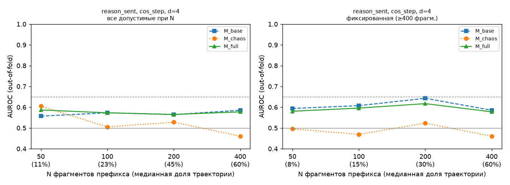

# E4 — результаты статистических тестов (main_nomic)

Модели: StandardScaler + логистическая регрессия (L2, C=1), без подбора гиперпараметров. Кросс-валидация: 5 фолдов, группировка по task_id (единая карта `outputs/folds.csv`). AUROC, PR-AUC и precision@10% считаются внутри каждого фолда и усредняются: объединение предсказаний разных фолдов смещает AUROC вниз (у модели каждого фолда свой свободный член, который сдвигается против доли провалов в тестовом фолде); объединённый AUROC для справки есть в summary.csv. ДИ — перцентильный бутстрэп по задачам внутри фолдов, 1000 повторов, seed 42.

## Главный ответ

Критерий успеха темы (AGENTS.md): нижняя граница 95% ДИ прироста AUROC (M_full − M_base) > 0.

**1. Заранее заданная основная комбинация** `('reason_sent', 'cos_step', 200, 4)` (n = 300, задач 226):
AUROC base = 0.564, chaos = 0.528, full = 0.565; Δ = 0.001 [95% ДИ -0.040; 0.040] → критерий **НЕ выполнен**.

**2. Вложенный выбор комбинации** (правило 4.1: комбинация выбирается в каждом внешнем фолде по внутренней CV только на обучающих фолдах; кандидаты — основная сетка AGENTS.md: seg ∈ ('reason_sent', 'all_sent'), N ∈ (100, 200, 400), все proj и d, всего 48 комбинаций; n = 300):
AUROC base = 0.569, chaos = 0.508, full = 0.589; Δ = 0.020 [95% ДИ -0.021; 0.063] → критерий **НЕ выполнен**.
Выбранные комбинации по внешним фолдам: ('reason_sent', 'cos_task', 100, 4) ×3; ('reason_sent', 'cos_task', 200, 4) ×2.

*Проверка чувствительности (не ответ):* тот же вложенный выбор, но из всех 88 комбинаций, включая контрольные seg=step и N=50. Выбранные: ('step', 'cos_step', 50, 3) ×3; ('step', 'pca1', 100, 4) ×1; ('step', 'pca1', 100, 3) ×1. Δ = 0.056 [95% ДИ -0.057; 0.180], n = 120. Этот вариант некорректен как ответ: он выбирает контрольную шаговую сегментацию (запрещена как основная, AGENTS.md п. 1) и маленькие выборки, где внутренняя оценка прироста шумная, — выбор «по максимуму» тогда ловит шум.

Остальные строки таблицы теста 4 — разведочные: их много, поэтому смотреть нужно на q (BH), а не на отдельные «находки».

## Данные и исключения

- траекторий в анализе: 300 (провалов 111, успехов 189)
- исключено до анализа (E0): infra_error:APIError [метка 1]: 1; infra_error:ServiceUnavailableError [метка 1]: 14; infra_error:Timeout [метка 1]: 1; missing_report [метка ?]: 9

Исключение коротких траекторий фильтром окна N (по классам):

| seg | N | исключено успехов | исключено провалов | доля успехов | доля провалов | асимметрия |
|---|---|---|---|---|---|---|
| all_sent | 50 | 0 | 0 | 0.000 | 0.000 | нет |
| all_sent | 100 | 0 | 0 | 0.000 | 0.000 | нет |
| all_sent | 200 | 0 | 0 | 0.000 | 0.000 | нет |
| all_sent | 400 | 22 | 5 | 0.116 | 0.045 | да |
| reason_sent | 50 | 0 | 0 | 0.000 | 0.000 | нет |
| reason_sent | 100 | 0 | 0 | 0.000 | 0.000 | нет |
| reason_sent | 200 | 0 | 0 | 0.000 | 0.000 | нет |
| reason_sent | 400 | 97 | 39 | 0.513 | 0.351 | да |
| step | 50 | 90 | 32 | 0.476 | 0.288 | да |
| step | 100 | 177 | 89 | 0.937 | 0.802 | да |
| step | 200 | 188 | 108 | 0.995 | 0.973 | нет |
| step | 400 | 189 | 111 | 1.000 | 1.000 | нет |

«Асимметрия» = доли исключённых в классах различаются более чем на 5 п.п.: это смещение выборки.

## Тест 4 — инкрементальность над тривиальными признаками

| seg | proj | N | d | n | AUROC base | AUROC chaos | AUROC full | Δ | 95% ДИ | q (BH) | ρ(H, длина) |
|---|---|---|---|---|---|---|---|---|---|---|---|
| all_sent | cos_step | 50 | 3 | 300 | 0.514 | 0.464 | 0.492 | -0.022 | [-0.073; 0.035] | 0.990 | -0.02 |
| all_sent | cos_step | 50 | 4 | 300 | 0.514 | 0.445 | 0.475 | -0.039 | [-0.091; 0.011] | 0.990 | -0.08 |
| all_sent | cos_step | 100 | 3 | 300 | 0.530 | 0.475 | 0.524 | -0.006 | [-0.031; 0.024] | 0.990 | 0.07 |
| all_sent | cos_step | 100 | 4 | 300 | 0.530 | 0.484 | 0.529 | -0.001 | [-0.053; 0.048] | 0.990 | 0.05 |
| all_sent | cos_step | 200 | 3 | 300 | 0.549 | 0.489 | 0.537 | -0.013 | [-0.056; 0.038] | 0.990 | 0.04 |
| all_sent | cos_step | 200 | 4 | 300 | 0.549 | 0.454 | 0.513 | -0.037 | [-0.072; 0.000] | 0.990 | -0.03 |
| all_sent | cos_step | 400 | 3 | 273 | 0.513 | 0.525 | 0.518 | 0.005 | [-0.039; 0.050] | 0.990 | -0.04 |
| all_sent | cos_step | 400 | 4 | 273 | 0.513 | 0.525 | 0.514 | 0.001 | [-0.036; 0.039] | 0.990 | 0.00 |
| all_sent | cos_task | 50 | 3 | 300 | 0.514 | 0.521 | 0.507 | -0.007 | [-0.062; 0.045] | 0.990 | 0.07 |
| all_sent | cos_task | 50 | 4 | 300 | 0.514 | 0.545 | 0.517 | 0.003 | [-0.059; 0.056] | 0.990 | 0.14 |
| all_sent | cos_task | 100 | 3 | 300 | 0.530 | 0.472 | 0.512 | -0.018 | [-0.042; 0.007] | 0.990 | 0.04 |
| all_sent | cos_task | 100 | 4 | 300 | 0.530 | 0.476 | 0.500 | -0.029 | [-0.065; 0.006] | 0.990 | 0.05 |
| all_sent | cos_task | 200 | 3 | 300 | 0.549 | 0.463 | 0.529 | -0.020 | [-0.047; 0.008] | 0.990 | 0.08 |
| all_sent | cos_task | 200 | 4 | 300 | 0.549 | 0.463 | 0.538 | -0.012 | [-0.030; 0.007] | 0.990 | 0.10 |
| all_sent | cos_task | 400 | 3 | 273 | 0.513 | 0.388 | 0.484 | -0.029 | [-0.061; -0.000] | 0.990 | 0.05 |
| all_sent | cos_task | 400 | 4 | 273 | 0.513 | 0.505 | 0.515 | 0.002 | [-0.028; 0.033] | 0.990 | 0.12 |
| all_sent | norm | 50 | 3 | 300 | 0.514 | 0.464 | 0.492 | -0.022 | [-0.073; 0.035] | 0.990 | -0.02 |
| all_sent | norm | 50 | 4 | 300 | 0.514 | 0.444 | 0.475 | -0.039 | [-0.091; 0.011] | 0.990 | -0.08 |
| all_sent | norm | 100 | 3 | 300 | 0.530 | 0.472 | 0.524 | -0.006 | [-0.031; 0.023] | 0.990 | 0.06 |
| all_sent | norm | 100 | 4 | 300 | 0.530 | 0.483 | 0.529 | -0.000 | [-0.053; 0.048] | 0.990 | 0.05 |
| all_sent | norm | 200 | 3 | 300 | 0.549 | 0.498 | 0.536 | -0.014 | [-0.058; 0.038] | 0.990 | 0.04 |
| all_sent | norm | 200 | 4 | 300 | 0.549 | 0.455 | 0.512 | -0.037 | [-0.072; 0.001] | 0.990 | -0.03 |
| all_sent | norm | 400 | 3 | 273 | 0.513 | 0.524 | 0.520 | 0.007 | [-0.037; 0.052] | 0.990 | -0.04 |
| all_sent | norm | 400 | 4 | 273 | 0.513 | 0.527 | 0.515 | 0.002 | [-0.035; 0.041] | 0.990 | 0.00 |
| all_sent | pca1 | 50 | 3 | 300 | 0.514 | 0.496 | 0.492 | -0.022 | [-0.068; 0.025] | 0.990 | 0.04 |
| all_sent | pca1 | 50 | 4 | 300 | 0.514 | 0.527 | 0.526 | 0.012 | [-0.042; 0.059] | 0.990 | 0.04 |
| all_sent | pca1 | 100 | 3 | 300 | 0.530 | 0.418 | 0.490 | -0.040 | [-0.072; -0.005] | 0.990 | 0.07 |
| all_sent | pca1 | 100 | 4 | 300 | 0.530 | 0.470 | 0.514 | -0.016 | [-0.050; 0.020] | 0.990 | 0.11 |
| all_sent | pca1 | 200 | 3 | 300 | 0.549 | 0.436 | 0.512 | -0.038 | [-0.075; -0.005] | 0.990 | 0.12 |
| all_sent | pca1 | 200 | 4 | 300 | 0.549 | 0.488 | 0.530 | -0.019 | [-0.057; 0.017] | 0.990 | 0.18 |
| all_sent | pca1 | 400 | 3 | 273 | 0.513 | 0.472 | 0.508 | -0.005 | [-0.022; 0.010] | 0.990 | 0.06 |
| all_sent | pca1 | 400 | 4 | 273 | 0.513 | 0.518 | 0.513 | 0.000 | [-0.026; 0.028] | 0.990 | 0.16 |
| reason_sent | cos_step | 50 | 3 | 300 | 0.557 | 0.536 | 0.539 | -0.018 | [-0.049; 0.016] | 0.990 | 0.04 |
| reason_sent | cos_step | 50 | 4 | 300 | 0.557 | 0.605 | 0.587 | 0.030 | [-0.030; 0.088] | 0.990 | 0.03 |
| reason_sent | cos_step | 100 | 3 | 300 | 0.573 | 0.498 | 0.569 | -0.004 | [-0.024; 0.014] | 0.990 | 0.12 |
| reason_sent | cos_step | 100 | 4 | 300 | 0.573 | 0.505 | 0.573 | -0.000 | [-0.035; 0.034] | 0.990 | 0.09 |
| reason_sent | cos_step | 200 | 3 | 300 | 0.564 | 0.528 | 0.565 | 0.001 | [-0.037; 0.043] | 0.990 | 0.02 |
| reason_sent | cos_step | 200 | 4 | 300 | 0.564 | 0.528 | 0.565 | 0.001 | [-0.040; 0.040] | 0.990 | 0.01 |
| reason_sent | cos_step | 400 | 3 | 164 | 0.585 | 0.475 | 0.583 | -0.002 | [-0.028; 0.020] | 0.990 | -0.10 |
| reason_sent | cos_step | 400 | 4 | 164 | 0.585 | 0.461 | 0.578 | -0.008 | [-0.038; 0.022] | 0.990 | -0.09 |
| reason_sent | cos_task | 50 | 3 | 300 | 0.557 | 0.462 | 0.554 | -0.003 | [-0.032; 0.028] | 0.990 | -0.01 |
| reason_sent | cos_task | 50 | 4 | 300 | 0.557 | 0.470 | 0.542 | -0.015 | [-0.052; 0.020] | 0.990 | 0.05 |
| reason_sent | cos_task | 100 | 3 | 300 | 0.573 | 0.513 | 0.569 | -0.004 | [-0.044; 0.035] | 0.990 | 0.05 |
| reason_sent | cos_task | 100 | 4 | 300 | 0.573 | 0.525 | 0.593 | 0.020 | [-0.029; 0.067] | 0.990 | 0.10 |
| reason_sent | cos_task | 200 | 3 | 300 | 0.564 | 0.515 | 0.562 | -0.003 | [-0.043; 0.038] | 0.990 | 0.11 |
| reason_sent | cos_task | 200 | 4 | 300 | 0.564 | 0.506 | 0.585 | 0.021 | [-0.018; 0.059] | 0.990 | 0.19 |
| reason_sent | cos_task | 400 | 3 | 164 | 0.585 | 0.542 | 0.581 | -0.004 | [-0.028; 0.021] | 0.990 | 0.13 |
| reason_sent | cos_task | 400 | 4 | 164 | 0.585 | 0.547 | 0.579 | -0.006 | [-0.032; 0.019] | 0.990 | 0.23 |
| reason_sent | norm | 50 | 3 | 300 | 0.557 | 0.537 | 0.540 | -0.017 | [-0.049; 0.016] | 0.990 | 0.04 |
| reason_sent | norm | 50 | 4 | 300 | 0.557 | 0.604 | 0.586 | 0.030 | [-0.029; 0.088] | 0.990 | 0.03 |
| reason_sent | norm | 100 | 3 | 300 | 0.573 | 0.499 | 0.569 | -0.004 | [-0.024; 0.014] | 0.990 | 0.12 |
| reason_sent | norm | 100 | 4 | 300 | 0.573 | 0.504 | 0.573 | -0.000 | [-0.035; 0.035] | 0.990 | 0.09 |
| reason_sent | norm | 200 | 3 | 300 | 0.564 | 0.530 | 0.564 | -0.000 | [-0.038; 0.043] | 0.990 | 0.02 |
| reason_sent | norm | 200 | 4 | 300 | 0.564 | 0.529 | 0.565 | 0.000 | [-0.040; 0.041] | 0.990 | 0.01 |
| reason_sent | norm | 400 | 3 | 164 | 0.585 | 0.475 | 0.583 | -0.002 | [-0.028; 0.020] | 0.990 | -0.10 |
| reason_sent | norm | 400 | 4 | 164 | 0.585 | 0.463 | 0.577 | -0.008 | [-0.039; 0.021] | 0.990 | -0.09 |
| reason_sent | pca1 | 50 | 3 | 300 | 0.557 | 0.533 | 0.569 | 0.012 | [-0.029; 0.047] | 0.990 | 0.06 |
| reason_sent | pca1 | 50 | 4 | 300 | 0.557 | 0.469 | 0.550 | -0.006 | [-0.046; 0.028] | 0.990 | 0.04 |
| reason_sent | pca1 | 100 | 3 | 300 | 0.573 | 0.512 | 0.568 | -0.005 | [-0.056; 0.040] | 0.990 | 0.17 |
| reason_sent | pca1 | 100 | 4 | 300 | 0.573 | 0.475 | 0.568 | -0.005 | [-0.048; 0.038] | 0.990 | 0.15 |
| reason_sent | pca1 | 200 | 3 | 300 | 0.564 | 0.503 | 0.557 | -0.007 | [-0.042; 0.026] | 0.990 | 0.16 |
| reason_sent | pca1 | 200 | 4 | 300 | 0.564 | 0.474 | 0.550 | -0.015 | [-0.048; 0.017] | 0.990 | 0.19 |
| reason_sent | pca1 | 400 | 3 | 164 | 0.585 | 0.581 | 0.598 | 0.013 | [-0.027; 0.051] | 0.990 | 0.11 |
| reason_sent | pca1 | 400 | 4 | 164 | 0.585 | 0.584 | 0.593 | 0.007 | [-0.023; 0.044] | 0.990 | 0.19 |
| step | cos_step | 50 | 3 | 178 | 0.461 | 0.584 | 0.554 | 0.093 | [0.004; 0.173] | 0.879 | 0.06 |
| step | cos_step | 50 | 4 | 178 | 0.461 | 0.541 | 0.464 | 0.003 | [-0.064; 0.070] | 0.990 | 0.05 |
| step | cos_step | 100 | 3 | 34 | 0.208 | 0.347 | 0.215 | 0.007 | [-0.111; 0.157] | 0.990 | 0.13 |
| step | cos_step | 100 | 4 | 34 | 0.208 | 0.604 | 0.229 | 0.021 | [-0.250; 0.275] | 0.990 | 0.06 |
| step | cos_step | 200 | 3 | 4 | — | — | — | — | [—; —] | — | -0.95 |
| step | cos_step | 200 | 4 | 4 | — | — | — | — | [—; —] | — | -0.74 |
| step | cos_task | 50 | 3 | 178 | 0.461 | 0.461 | 0.443 | -0.018 | [-0.062; 0.028] | 0.990 | 0.02 |
| step | cos_task | 50 | 4 | 178 | 0.461 | 0.549 | 0.470 | 0.009 | [-0.054; 0.066] | 0.990 | 0.01 |
| step | cos_task | 100 | 3 | 34 | 0.208 | 0.285 | 0.201 | -0.007 | [-0.214; 0.185] | 0.990 | -0.13 |
| step | cos_task | 100 | 4 | 34 | 0.208 | 0.264 | 0.139 | -0.069 | [-0.261; 0.083] | 0.990 | -0.18 |
| step | cos_task | 200 | 3 | 4 | — | — | — | — | [—; —] | — | -0.74 |
| step | cos_task | 200 | 4 | 4 | — | — | — | — | [—; —] | — | -0.74 |
| step | norm | 50 | 3 | 178 | 0.461 | 0.584 | 0.554 | 0.093 | [0.004; 0.173] | 0.879 | 0.06 |
| step | norm | 50 | 4 | 178 | 0.461 | 0.541 | 0.464 | 0.003 | [-0.064; 0.070] | 0.990 | 0.05 |
| step | norm | 100 | 3 | 34 | 0.208 | 0.347 | 0.215 | 0.007 | [-0.111; 0.157] | 0.990 | 0.13 |
| step | norm | 100 | 4 | 34 | 0.208 | 0.604 | 0.229 | 0.021 | [-0.250; 0.275] | 0.990 | 0.06 |
| step | norm | 200 | 3 | 4 | — | — | — | — | [—; —] | — | -0.95 |
| step | norm | 200 | 4 | 4 | — | — | — | — | [—; —] | — | -0.74 |
| step | pca1 | 50 | 3 | 178 | 0.461 | 0.480 | 0.451 | -0.011 | [-0.061; 0.039] | 0.990 | -0.09 |
| step | pca1 | 50 | 4 | 178 | 0.461 | 0.376 | 0.412 | -0.049 | [-0.104; 0.003] | 0.990 | 0.02 |
| step | pca1 | 100 | 3 | 34 | 0.208 | 0.278 | 0.146 | -0.063 | [-0.287; 0.074] | 0.990 | -0.12 |
| step | pca1 | 100 | 4 | 34 | 0.208 | 0.583 | 0.160 | -0.049 | [-0.267; 0.125] | 0.990 | -0.00 |
| step | pca1 | 200 | 3 | 4 | — | — | — | — | [—; —] | — | -0.74 |
| step | pca1 | 200 | 4 | 4 | — | — | — | — | [—; —] | — | -0.74 |

Комбинаций с нижней границей ДИ > 0: 2 из 88; значимых после BH (q < 0.05): 0.
ρ(H, длина) — Спирмен между H и полной длиной траектории во фрагментах (диагностика; в модели длина полной траектории не входит). Высокий |ρ| означает, что H вторичен по отношению к длине.

## Тест 3 — различение внутри задачи

Манна–Уитни между классами в каждой задаче с обоими классами; эффект — ранг-бисериальная корреляция (> 0: выше у провалов); BH по задачам. «Доля > 0» — доля задач (с ненулевым эффектом), где H выше у провалов; q знак. — знаковый тест этой доли против 0.5 по задачам, с BH по всем комбинациям.

| seg | proj | N | d | задач | доля знач. H | медиана эффекта H | доля > 0 (H) | q знак. H | медиана эффекта C | доля > 0 (C) | q знак. C | задач ≥3/≥3 |
|---|---|---|---|---|---|---|---|---|---|---|---|---|
| all_sent | cos_step | 50 | 3 | 18 | 0.000 | 0.000 | 0.500 | 1.000 | 0.000 | 0.500 | 1.000 | 0 |
| all_sent | cos_step | 50 | 4 | 18 | 0.000 | 0.500 | 0.600 | 1.000 | 0.000 | 0.533 | 1.000 | 0 |
| all_sent | cos_step | 100 | 3 | 18 | 0.000 | 1.000 | 0.733 | 1.000 | -1.000 | 0.267 | 0.862 | 0 |
| all_sent | cos_step | 100 | 4 | 18 | 0.000 | 0.500 | 0.529 | 1.000 | 0.500 | 0.529 | 1.000 | 0 |
| all_sent | cos_step | 200 | 3 | 18 | 0.000 | -0.500 | 0.400 | 1.000 | 0.500 | 0.600 | 1.000 | 0 |
| all_sent | cos_step | 200 | 4 | 18 | 0.000 | -0.500 | 0.471 | 1.000 | 0.500 | 0.529 | 1.000 | 0 |
| all_sent | cos_step | 400 | 3 | 17 | 0.000 | 0.000 | 0.500 | 1.000 | 0.000 | 0.500 | 1.000 | 0 |
| all_sent | cos_step | 400 | 4 | 17 | 0.000 | 0.000 | 0.500 | 1.000 | 0.000 | 0.462 | 1.000 | 0 |
| all_sent | cos_task | 50 | 3 | 18 | 0.000 | -0.667 | 0.444 | 1.000 | 0.667 | 0.556 | 1.000 | 0 |
| all_sent | cos_task | 50 | 4 | 18 | 0.000 | -0.500 | 0.438 | 1.000 | 0.500 | 0.562 | 1.000 | 0 |
| all_sent | cos_task | 100 | 3 | 18 | 0.000 | 0.167 | 0.562 | 1.000 | -0.167 | 0.438 | 1.000 | 0 |
| all_sent | cos_task | 100 | 4 | 18 | 0.000 | 0.500 | 0.600 | 1.000 | -0.500 | 0.438 | 1.000 | 0 |
| all_sent | cos_task | 200 | 3 | 18 | 0.000 | -1.000 | 0.312 | 1.000 | 1.000 | 0.688 | 1.000 | 0 |
| all_sent | cos_task | 200 | 4 | 18 | 0.000 | -1.000 | 0.235 | 1.000 | 1.000 | 0.765 | 0.862 | 0 |
| all_sent | cos_task | 400 | 3 | 17 | 0.000 | 0.000 | 0.533 | 1.000 | 0.000 | 0.467 | 1.000 | 0 |
| all_sent | cos_task | 400 | 4 | 17 | 0.000 | -1.000 | 0.286 | 1.000 | 1.000 | 0.643 | 1.000 | 0 |
| all_sent | norm | 50 | 3 | 18 | 0.000 | 0.000 | 0.500 | 1.000 | 0.000 | 0.500 | 1.000 | 0 |
| all_sent | norm | 50 | 4 | 18 | 0.000 | 0.500 | 0.600 | 1.000 | 0.000 | 0.533 | 1.000 | 0 |
| all_sent | norm | 100 | 3 | 18 | 0.000 | 1.000 | 0.733 | 1.000 | -1.000 | 0.267 | 0.862 | 0 |
| all_sent | norm | 100 | 4 | 18 | 0.000 | 0.500 | 0.529 | 1.000 | 0.500 | 0.529 | 1.000 | 0 |
| all_sent | norm | 200 | 3 | 18 | 0.000 | -0.500 | 0.400 | 1.000 | 0.500 | 0.600 | 1.000 | 0 |
| all_sent | norm | 200 | 4 | 18 | 0.000 | -0.500 | 0.471 | 1.000 | 0.500 | 0.529 | 1.000 | 0 |
| all_sent | norm | 400 | 3 | 17 | 0.000 | 0.000 | 0.500 | 1.000 | 0.000 | 0.500 | 1.000 | 0 |
| all_sent | norm | 400 | 4 | 17 | 0.000 | 0.000 | 0.500 | 1.000 | 0.000 | 0.462 | 1.000 | 0 |
| all_sent | pca1 | 50 | 3 | 18 | 0.000 | 0.000 | 0.571 | 1.000 | 0.000 | 0.429 | 1.000 | 0 |
| all_sent | pca1 | 50 | 4 | 18 | 0.000 | 1.000 | 0.722 | 1.000 | -1.000 | 0.222 | 0.862 | 0 |
| all_sent | pca1 | 100 | 3 | 18 | 0.000 | 0.500 | 0.529 | 1.000 | -0.500 | 0.471 | 1.000 | 0 |
| all_sent | pca1 | 100 | 4 | 18 | 0.000 | -0.667 | 0.444 | 1.000 | 1.000 | 0.611 | 1.000 | 0 |
| all_sent | pca1 | 200 | 3 | 18 | 0.000 | 0.500 | 0.562 | 1.000 | -0.500 | 0.438 | 1.000 | 0 |
| all_sent | pca1 | 200 | 4 | 18 | 0.000 | -1.000 | 0.250 | 1.000 | 1.000 | 0.750 | 0.862 | 0 |
| all_sent | pca1 | 400 | 3 | 17 | 0.000 | -1.000 | 0.353 | 1.000 | 1.000 | 0.647 | 1.000 | 0 |
| all_sent | pca1 | 400 | 4 | 17 | 0.000 | -1.000 | 0.235 | 1.000 | 1.000 | 0.765 | 0.862 | 0 |
| reason_sent | cos_step | 50 | 3 | 18 | 0.000 | 1.000 | 0.750 | 1.000 | -1.000 | 0.250 | 0.862 | 0 |
| reason_sent | cos_step | 50 | 4 | 18 | 0.000 | 0.000 | 0.500 | 1.000 | 0.167 | 0.529 | 1.000 | 0 |
| reason_sent | cos_step | 100 | 3 | 18 | 0.000 | 0.667 | 0.588 | 1.000 | -0.667 | 0.412 | 1.000 | 0 |
| reason_sent | cos_step | 100 | 4 | 18 | 0.000 | 0.167 | 0.529 | 1.000 | -0.667 | 0.412 | 1.000 | 0 |
| reason_sent | cos_step | 200 | 3 | 18 | 0.000 | -0.167 | 0.357 | 1.000 | 0.167 | 0.643 | 1.000 | 0 |
| reason_sent | cos_step | 200 | 4 | 18 | 0.000 | -1.000 | 0.312 | 1.000 | 1.000 | 0.733 | 0.862 | 0 |
| reason_sent | cos_step | 400 | 3 | 10 | 0.000 | -0.500 | 0.286 | 1.000 | 1.000 | 0.750 | 1.000 | 0 |
| reason_sent | cos_step | 400 | 4 | 10 | 0.000 | -0.500 | 0.375 | 1.000 | 0.500 | 0.625 | 1.000 | 0 |
| reason_sent | cos_task | 50 | 3 | 18 | 0.000 | -0.167 | 0.471 | 1.000 | 0.167 | 0.529 | 1.000 | 0 |
| reason_sent | cos_task | 50 | 4 | 18 | 0.000 | -0.167 | 0.438 | 1.000 | 0.667 | 0.625 | 1.000 | 0 |
| reason_sent | cos_task | 100 | 3 | 18 | 0.000 | 0.000 | 0.500 | 1.000 | 0.000 | 0.500 | 1.000 | 0 |
| reason_sent | cos_task | 100 | 4 | 18 | 0.000 | 0.000 | 0.467 | 1.000 | 0.000 | 0.533 | 1.000 | 0 |
| reason_sent | cos_task | 200 | 3 | 18 | 0.000 | -0.167 | 0.400 | 1.000 | 0.167 | 0.600 | 1.000 | 0 |
| reason_sent | cos_task | 200 | 4 | 18 | 0.000 | -1.000 | 0.312 | 1.000 | 1.000 | 0.625 | 1.000 | 0 |
| reason_sent | cos_task | 400 | 3 | 10 | 0.000 | -0.667 | 0.250 | 1.000 | 0.667 | 0.750 | 1.000 | 0 |
| reason_sent | cos_task | 400 | 4 | 10 | 0.000 | 0.000 | 0.500 | 1.000 | 0.000 | 0.500 | 1.000 | 0 |
| reason_sent | norm | 50 | 3 | 18 | 0.000 | 1.000 | 0.750 | 1.000 | -1.000 | 0.250 | 0.862 | 0 |
| reason_sent | norm | 50 | 4 | 18 | 0.000 | 0.000 | 0.500 | 1.000 | 0.167 | 0.529 | 1.000 | 0 |
| reason_sent | norm | 100 | 3 | 18 | 0.000 | 0.667 | 0.588 | 1.000 | -0.667 | 0.412 | 1.000 | 0 |
| reason_sent | norm | 100 | 4 | 18 | 0.000 | 0.167 | 0.529 | 1.000 | -0.667 | 0.412 | 1.000 | 0 |
| reason_sent | norm | 200 | 3 | 18 | 0.000 | -0.667 | 0.333 | 1.000 | 0.667 | 0.667 | 1.000 | 0 |
| reason_sent | norm | 200 | 4 | 18 | 0.000 | -1.000 | 0.312 | 1.000 | 1.000 | 0.733 | 0.862 | 0 |
| reason_sent | norm | 400 | 3 | 10 | 0.000 | -0.500 | 0.286 | 1.000 | 1.000 | 0.750 | 1.000 | 0 |
| reason_sent | norm | 400 | 4 | 10 | 0.000 | -0.500 | 0.375 | 1.000 | 0.500 | 0.625 | 1.000 | 0 |
| reason_sent | pca1 | 50 | 3 | 18 | 0.000 | -1.000 | 0.389 | 1.000 | 1.000 | 0.611 | 1.000 | 0 |
| reason_sent | pca1 | 50 | 4 | 18 | 0.000 | -1.000 | 0.353 | 1.000 | 0.667 | 0.588 | 1.000 | 0 |
| reason_sent | pca1 | 100 | 3 | 18 | 0.000 | 0.000 | 0.467 | 1.000 | 0.000 | 0.533 | 1.000 | 0 |
| reason_sent | pca1 | 100 | 4 | 18 | 0.000 | 0.000 | 0.500 | 1.000 | -0.500 | 0.438 | 1.000 | 0 |
| reason_sent | pca1 | 200 | 3 | 18 | 0.000 | -0.500 | 0.471 | 1.000 | 0.500 | 0.529 | 1.000 | 0 |
| reason_sent | pca1 | 200 | 4 | 18 | 0.000 | -1.000 | 0.333 | 1.000 | 0.500 | 0.600 | 1.000 | 0 |
| reason_sent | pca1 | 400 | 3 | 10 | 0.000 | -1.000 | 0.222 | 1.000 | 1.000 | 0.778 | 1.000 | 0 |
| reason_sent | pca1 | 400 | 4 | 10 | 0.000 | -1.000 | 0.111 | 1.000 | 1.000 | 0.889 | 0.862 | 0 |
| step | cos_step | 50 | 3 | 7 | 0.000 | 0.000 | 0.500 | 1.000 | 0.000 | 0.500 | 1.000 | 0 |
| step | cos_step | 50 | 4 | 7 | 0.000 | 0.000 | 0.500 | 1.000 | 0.000 | 0.500 | 1.000 | 0 |
| step | cos_step | 100 | 3 | 2 | 0.000 | 0.000 | 0.500 | 1.000 | 0.000 | 0.500 | 1.000 | 0 |
| step | cos_step | 100 | 4 | 2 | 0.000 | -1.000 | 0.000 | 1.000 | 1.000 | 1.000 | 1.000 | 0 |
| step | cos_step | 200 | 3 | 0 | — | — | — | — | — | — | — | 0 |
| step | cos_step | 200 | 4 | 0 | — | — | — | — | — | — | — | 0 |
| step | cos_task | 50 | 3 | 7 | 0.000 | -1.000 | 0.429 | 1.000 | 1.000 | 0.714 | 1.000 | 0 |
| step | cos_task | 50 | 4 | 7 | 0.000 | 0.000 | 0.500 | 1.000 | 0.000 | 0.500 | 1.000 | 0 |
| step | cos_task | 100 | 3 | 2 | 0.000 | 1.000 | 1.000 | 1.000 | -1.000 | 0.000 | 1.000 | 0 |
| step | cos_task | 100 | 4 | 2 | 0.000 | 1.000 | 1.000 | 1.000 | -1.000 | 0.000 | 1.000 | 0 |
| step | cos_task | 200 | 3 | 0 | — | — | — | — | — | — | — | 0 |
| step | cos_task | 200 | 4 | 0 | — | — | — | — | — | — | — | 0 |
| step | norm | 50 | 3 | 7 | 0.000 | 0.000 | 0.500 | 1.000 | 0.000 | 0.500 | 1.000 | 0 |
| step | norm | 50 | 4 | 7 | 0.000 | 0.000 | 0.500 | 1.000 | 0.000 | 0.500 | 1.000 | 0 |
| step | norm | 100 | 3 | 2 | 0.000 | 0.000 | 0.500 | 1.000 | 0.000 | 0.500 | 1.000 | 0 |
| step | norm | 100 | 4 | 2 | 0.000 | -1.000 | 0.000 | 1.000 | 1.000 | 1.000 | 1.000 | 0 |
| step | norm | 200 | 3 | 0 | — | — | — | — | — | — | — | 0 |
| step | norm | 200 | 4 | 0 | — | — | — | — | — | — | — | 0 |
| step | pca1 | 50 | 3 | 7 | 0.000 | 1.000 | 0.571 | 1.000 | -1.000 | 0.429 | 1.000 | 0 |
| step | pca1 | 50 | 4 | 7 | 0.000 | -1.000 | 0.429 | 1.000 | 1.000 | 0.571 | 1.000 | 0 |
| step | pca1 | 100 | 3 | 2 | 0.000 | 0.000 | 0.500 | 1.000 | 0.000 | 0.500 | 1.000 | 0 |
| step | pca1 | 100 | 4 | 2 | 0.000 | 0.000 | 0.500 | 1.000 | 0.000 | 0.500 | 1.000 | 0 |
| step | pca1 | 200 | 3 | 0 | — | — | — | — | — | — | — | 0 |
| step | pca1 | 200 | 4 | 0 | — | — | — | — | — | — | — | 0 |

- Отдельные задачи: доля задач со значимым различием после BH — 0.000 в лучшей комбинации (в задаче 1–16 прогонов на класс, мощности нет).
- Направление: в 0 из 88 комбинаций перекос направления по задачам устойчив (знаковый тест, q < 0.05); из них в 0 энтропия H **ниже у провалов**, в 0 — выше.
- **Разнонаправленность** (AGENTS.md: тревожный признак): в основной сетке (48 комбинаций) доля задач с направлением большинства — от 0.50 до 0.89 (медиана 0.60), то есть в медианной комбинации 40% задач показывают противоположное направление. Сдвиг есть «в среднем по задачам», но он слабый и не универсален.
Примечание: при 1–2 прогонах класса в задаче тест Манна–Уитни не может дать значимость; поэтому отдельно приведено число задач, где каждого класса ≥ 3.

## Тест 5 — ранний прогноз

Комбинация `reason_sent, cos_step, d=4`:

| популяция | N | n | медианная доля траектории | AUROC base | AUROC chaos | AUROC full |
|---|---|---|---|---|---|---|
| все допустимые при N | 50 | 300 | 0.11 | 0.557 | 0.605 | 0.587 |
| все допустимые при N | 100 | 300 | 0.23 | 0.573 | 0.505 | 0.573 |
| все допустимые при N | 200 | 300 | 0.45 | 0.564 | 0.528 | 0.565 |
| все допустимые при N | 400 | 164 | 0.60 | 0.585 | 0.461 | 0.578 |
| фиксированная (≥400 фрагм.) | 50 | 164 | 0.08 | 0.594 | 0.496 | 0.580 |
| фиксированная (≥400 фрагм.) | 100 | 164 | 0.15 | 0.607 | 0.469 | 0.596 |
| фиксированная (≥400 фрагм.) | 200 | 164 | 0.30 | 0.643 | 0.523 | 0.617 |
| фиксированная (≥400 фрагм.) | 400 | 164 | 0.60 | 0.585 | 0.461 | 0.578 |
- все допустимые при N, M_full: AUROC впервые > 0.65 при — не превышает ни при одном N
- все допустимые при N, M_chaos: AUROC впервые > 0.65 при — не превышает ни при одном N
- фиксированная (≥400 фрагм.), M_full: AUROC впервые > 0.65 при — не превышает ни при одном N
- фиксированная (≥400 фрагм.), M_chaos: AUROC впервые > 0.65 при — не превышает ни при одном N

«Все допустимые при N» — у каждого N своя выборка (короткие траектории выпадают), поэтому кривая смешивает эффект префикса и смену выборки. «Фиксированная» — одни и те же траектории при растущем префиксе; именно она показывает ранний прогноз в чистом виде.

## Тест 6 — перенос

Обучение на других семействах/версиях (и других фолдах задач) → тест на целевой группе; сравнение с AUROC внутри распределения на тех же строках. «Падение» = in − cross.

| комбинация | ось | обучение | тест | n теста | AUROC full in | AUROC full cross | падение full | AUROC chaos in | AUROC chaos cross | падение chaos |
|---|---|---|---|---|---|---|---|---|---|---|
| ('reason_sent', 'cos_step', 200, 4) | семейство моделей | все остальные | anthropic | 56 | 0.514 | 0.552 | -0.037 | 0.435 | 0.420 | 0.015 |
| ('reason_sent', 'cos_step', 200, 4) | семейство моделей | все остальные | deepseek | 11 | 0.500 | 0.500 | 0.000 | 0.500 | 0.500 | 0.000 |
| ('reason_sent', 'cos_step', 200, 4) | семейство моделей | все остальные | google | 84 | 0.522 | 0.499 | 0.023 | 0.417 | 0.408 | 0.009 |
| ('reason_sent', 'cos_step', 200, 4) | семейство моделей | все остальные | minimax | 44 | 0.580 | 0.636 | -0.056 | 0.536 | 0.546 | -0.010 |
| ('reason_sent', 'cos_step', 200, 4) | семейство моделей | все остальные | mistral | 40 | 0.569 | 0.361 | 0.208 | 0.689 | 0.524 | 0.165 |
| ('reason_sent', 'cos_step', 200, 4) | семейство моделей | все остальные | moonshot | 13 | 0.417 | 0.417 | 0.000 | 0.278 | 0.278 | 0.000 |
| ('reason_sent', 'cos_step', 200, 4) | семейство моделей | все остальные | zhipu | 52 | 0.594 | 0.648 | -0.054 | 0.561 | 0.562 | -0.002 |
| ('reason_sent', 'cos_step', 200, 4) | версия агента | v1.x | v2.x | 140 | 0.514 | 0.608 | -0.095 | 0.455 | 0.479 | -0.024 |
| ('reason_sent', 'cos_step', 200, 4) | версия агента | v2.x | v1.x | 160 | 0.612 | 0.617 | -0.005 | 0.588 | 0.551 | 0.038 |
| ('reason_sent', 'cos_task', 100, 4) | семейство моделей | все остальные | anthropic | 56 | 0.500 | 0.553 | -0.053 | 0.532 | 0.548 | -0.017 |
| ('reason_sent', 'cos_task', 100, 4) | семейство моделей | все остальные | deepseek | 11 | 0.750 | 0.250 | 0.500 | 0.750 | 0.750 | 0.000 |
| ('reason_sent', 'cos_task', 100, 4) | семейство моделей | все остальные | google | 84 | 0.569 | 0.552 | 0.017 | 0.509 | 0.491 | 0.018 |
| ('reason_sent', 'cos_task', 100, 4) | семейство моделей | все остальные | minimax | 44 | 0.663 | 0.584 | 0.079 | 0.546 | 0.520 | 0.026 |
| ('reason_sent', 'cos_task', 100, 4) | семейство моделей | все остальные | mistral | 40 | 0.646 | 0.658 | -0.013 | 0.641 | 0.635 | 0.006 |
| ('reason_sent', 'cos_task', 100, 4) | семейство моделей | все остальные | moonshot | 13 | 0.833 | 0.833 | 0.000 | 0.542 | 0.542 | 0.000 |
| ('reason_sent', 'cos_task', 100, 4) | семейство моделей | все остальные | zhipu | 52 | 0.544 | 0.527 | 0.018 | 0.637 | 0.644 | -0.006 |
| ('reason_sent', 'cos_task', 100, 4) | версия агента | v1.x | v2.x | 140 | 0.581 | 0.598 | -0.017 | 0.504 | 0.467 | 0.037 |
| ('reason_sent', 'cos_task', 100, 4) | версия агента | v2.x | v1.x | 160 | 0.608 | 0.580 | 0.028 | 0.529 | 0.538 | -0.009 |

Перенос между бенчмарками не проводился: используется один источник (SWE-bench).

## Ограничения

- **Выборка источника.** Один бенчмарк (SWE-bench Verified, Python-репозитории), один агентный каркас (mini-SWE-agent, версии 1.x и 2.0). Прогоны отобраны по наличию видимого текста рассуждений (модели со скрытыми рассуждениями, например GPT-5/o3, не вошли) — выводы на них не переносятся.
- **Фильтр окна.** Траектории короче N исключены; если доли исключённых различаются по классам (таблица выше), выборка при данном N смещена. Длинные траектории чаще провальные — результат при больших N относится к «длинным» прогонам.
- **Связь с длиной.** Спирмен H и полной длины для основной комбинации: 0.01, 0.19, 0.01, 0.19. Полная длина траектории — информация из будущего, в модель не входит; префиксные тривиальные признаки входят в M_base.
- **Проекции norm и cos_step** на эмбеддингах единичной нормы монотонно связаны (norm = √(2·cos_step)), поэтому их H и C совпадают: это не две независимые проверки.
- **Маскировка маркеров исхода** (`config/leak_markers.txt`) убирает явные фразы, но не все косвенные признаки успеха в тексте; агенты часто заявляют «all tests pass» и в провальных прогонах (см. E0).
- **Метка** — результат тестов SWE-bench (FAIL_TO_PASS и PASS_TO_PASS); прогоны, упавшие из-за инфраструктуры провайдера, исключены (E0).
- **Чего нельзя утверждать:** причинную связь хаотичности и провала; применимость к другим доменам, каркасам и моделям со скрытыми рассуждениями; что отдельные значимые комбинации из разведочной таблицы — не случайность (смотреть q после BH и вложенный выбор).

