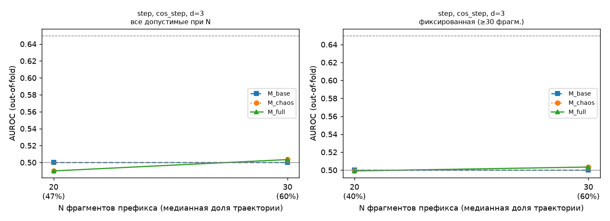

# E4 — результаты статистических тестов (smoke_mahmoud)

**Смоук-тест конвейера E4 и шаговый контроль — НЕ результат работы.** Данные: готовые шаговые эмбеддинги nomic (Mahmoud-queens, архив multi_model: 6 прогонов SWE-bench Verified), текста нет, окно N = 20/30 шагов (режим, где по AGENTS.md п. 1 метод неотличим от шума). Тривиальные признаки по тексту недоступны, поэтому M_base — константная модель (AUROC 0.5), а Δ фактически сравнивает хаос-признаки с нулём. Тест 6 «семейство» здесь = прогон (агент×модель).

Модели: StandardScaler + логистическая регрессия (L2, C=1), без подбора гиперпараметров. Кросс-валидация: 5 фолдов, группировка по task_id (единая карта `outputs/folds.csv`). AUROC, PR-AUC и precision@10% считаются внутри каждого фолда и усредняются: объединение предсказаний разных фолдов смещает AUROC вниз (у модели каждого фолда свой свободный член, который сдвигается против доли провалов в тестовом фолде); объединённый AUROC для справки есть в summary.csv. ДИ — перцентильный бутстрэп по задачам внутри фолдов, 1000 повторов, seed 42.

## Главный ответ

Критерий успеха темы (AGENTS.md): нижняя граница 95% ДИ прироста AUROC (M_full − M_base) > 0.

**1. Заранее заданная основная комбинация** `('step', 'cos_step', 30, 3)` (n = 2011, задач 500):
AUROC base = 0.500, chaos = 0.503, full = 0.503; Δ = 0.003 [95% ДИ -0.020; 0.029] → критерий **НЕ выполнен**.

**2. Вложенный выбор комбинации** (правило 4.1: комбинация выбирается во внешнем фолде по внутренней CV только на обучающих фолдах; n = 2202):
AUROC base = 0.500, chaos = 0.497, full = 0.497; Δ = -0.003 [95% ДИ -0.027; 0.020] → критерий **НЕ выполнен**.
Выбранные комбинации по внешним фолдам: ('step', 'pca1', 30, 3) ×2; ('step', 'cos_step', 20, 4) ×2; ('step', 'norm', 30, 4) ×1.

Остальные строки таблицы теста 4 — разведочные: их много, поэтому смотреть нужно на q (BH), а не на отдельные «находки».

## Данные и исключения

- траекторий в анализе: 3000 (провалов 1134, успехов 1866)

Исключение коротких траекторий фильтром окна N (по классам):

| seg | N | исключено успехов | исключено провалов | доля успехов | доля провалов | асимметрия |
|---|---|---|---|---|---|---|
| step | 20 | 330 | 125 | 0.177 | 0.110 | да |
| step | 30 | 704 | 285 | 0.377 | 0.251 | да |

«Асимметрия» = доли исключённых в классах различаются более чем на 5 п.п.: это смещение выборки.

## Тест 4 — инкрементальность над тривиальными признаками

| seg | proj | N | d | n | AUROC base | AUROC chaos | AUROC full | Δ | 95% ДИ | q (BH) | ρ(H, длина) |
|---|---|---|---|---|---|---|---|---|---|---|---|
| step | cos_step | 20 | 3 | 2545 | 0.500 | 0.490 | 0.490 | -0.010 | [-0.030; 0.013] | 0.833 | -0.01 |
| step | cos_step | 20 | 4 | 2545 | 0.500 | 0.523 | 0.523 | 0.023 | [-0.001; 0.044] | 0.228 | 0.01 |
| step | cos_step | 30 | 3 | 2011 | 0.500 | 0.503 | 0.503 | 0.003 | [-0.020; 0.029] | 0.625 | 0.01 |
| step | cos_step | 30 | 4 | 2011 | 0.500 | 0.507 | 0.507 | 0.007 | [-0.018; 0.031] | 0.625 | 0.01 |
| step | norm | 20 | 3 | 2545 | 0.500 | 0.489 | 0.489 | -0.011 | [-0.031; 0.012] | 0.833 | -0.01 |
| step | norm | 20 | 4 | 2545 | 0.500 | 0.522 | 0.522 | 0.022 | [-0.002; 0.042] | 0.228 | 0.01 |
| step | norm | 30 | 3 | 2011 | 0.500 | 0.503 | 0.503 | 0.003 | [-0.019; 0.029] | 0.625 | 0.01 |
| step | norm | 30 | 4 | 2011 | 0.500 | 0.507 | 0.507 | 0.007 | [-0.018; 0.031] | 0.625 | 0.01 |
| step | pca1 | 20 | 3 | 2545 | 0.500 | 0.499 | 0.499 | -0.001 | [-0.023; 0.021] | 0.640 | 0.03 |
| step | pca1 | 20 | 4 | 2545 | 0.500 | 0.502 | 0.502 | 0.002 | [-0.019; 0.022] | 0.625 | 0.04 |
| step | pca1 | 30 | 3 | 2011 | 0.500 | 0.504 | 0.504 | 0.004 | [-0.021; 0.030] | 0.625 | -0.00 |
| step | pca1 | 30 | 4 | 2011 | 0.500 | 0.501 | 0.501 | 0.001 | [-0.025; 0.024] | 0.625 | 0.02 |

Комбинаций с нижней границей ДИ > 0: 0 из 12; значимых после BH (q < 0.05): 0.
ρ(H, длина) — Спирмен между H и полной длиной траектории во фрагментах (диагностика; в модели длина полной траектории не входит). Высокий |ρ| означает, что H вторичен по отношению к длине.

## Тест 3 — различение внутри задачи

Манна–Уитни между классами в каждой задаче с обоими классами; эффект — ранг-бисериальная корреляция (> 0: выше у провалов); BH по задачам. «Доля одного знака» — доля задач с направлением большинства.

| seg | proj | N | d | задач | доля знач. H | медиана эффекта H | доля одного знака H | доля знач. C | медиана эффекта C | доля одного знака C | задач ≥3/≥3 |
|---|---|---|---|---|---|---|---|---|---|---|---|
| step | cos_step | 20 | 3 | 212 | 0.000 | -0.111 | 0.571 | 0.000 | 0.111 | 0.569 | 16 |
| step | cos_step | 20 | 4 | 212 | 0.000 | -0.146 | 0.589 | 0.000 | 0.183 | 0.600 | 16 |
| step | cos_step | 30 | 3 | 187 | 0.000 | 0.000 | 0.542 | 0.000 | 0.000 | 0.545 | 8 |
| step | cos_step | 30 | 4 | 187 | 0.000 | -0.111 | 0.589 | 0.000 | 0.000 | 0.581 | 8 |
| step | norm | 20 | 3 | 212 | 0.000 | -0.111 | 0.566 | 0.000 | 0.056 | 0.564 | 16 |
| step | norm | 20 | 4 | 212 | 0.000 | -0.125 | 0.584 | 0.000 | 0.167 | 0.600 | 16 |
| step | norm | 30 | 3 | 187 | 0.000 | 0.000 | 0.542 | 0.000 | 0.000 | 0.545 | 8 |
| step | norm | 30 | 4 | 187 | 0.000 | -0.111 | 0.589 | 0.000 | 0.000 | 0.581 | 8 |
| step | pca1 | 20 | 3 | 212 | 0.000 | -0.118 | 0.571 | 0.000 | 0.000 | 0.556 | 16 |
| step | pca1 | 20 | 4 | 212 | 0.000 | 0.000 | 0.541 | 0.000 | 0.000 | 0.540 | 16 |
| step | pca1 | 30 | 3 | 187 | 0.000 | 0.000 | 0.570 | 0.000 | 0.000 | 0.559 | 8 |
| step | pca1 | 30 | 4 | 187 | 0.000 | 0.000 | 0.570 | 0.000 | 0.000 | 0.573 | 8 |

**Разнонаправленный эффект** (доля одного знака H < 0.75) в 12 из 12 комбинаций: step/cos_step/N=20/d=3, step/cos_step/N=20/d=4, step/cos_step/N=30/d=3, step/cos_step/N=30/d=4, step/norm/N=20/d=3, step/norm/N=20/d=4, step/norm/N=30/d=3, step/norm/N=30/d=4, step/pca1/N=20/d=3, step/pca1/N=20/d=4, step/pca1/N=30/d=3, step/pca1/N=30/d=4. Это тревожный признак: в разных задачах энтропия провалов то выше, то ниже, чем у успехов.
Примечание: при 1–2 прогонах класса в задаче тест Манна–Уитни не может дать значимость; поэтому отдельно приведено число задач, где каждого класса ≥ 3.

## Тест 5 — ранний прогноз

Комбинация `step, cos_step, d=3`:

| популяция | N | n | медианная доля траектории | AUROC base | AUROC chaos | AUROC full |
|---|---|---|---|---|---|---|
| все допустимые при N | 20 | 2545 | 0.47 | 0.500 | 0.490 | 0.490 |
| все допустимые при N | 30 | 2011 | 0.60 | 0.500 | 0.503 | 0.503 |
| фиксированная (≥30 фрагм.) | 20 | 2011 | 0.40 | 0.500 | 0.499 | 0.499 |
| фиксированная (≥30 фрагм.) | 30 | 2011 | 0.60 | 0.500 | 0.503 | 0.503 |
- все допустимые при N, M_full: AUROC впервые > 0.65 при — не превышает ни при одном N
- все допустимые при N, M_chaos: AUROC впервые > 0.65 при — не превышает ни при одном N
- фиксированная (≥30 фрагм.), M_full: AUROC впервые > 0.65 при — не превышает ни при одном N
- фиксированная (≥30 фрагм.), M_chaos: AUROC впервые > 0.65 при — не превышает ни при одном N

«Все допустимые при N» — у каждого N своя выборка (короткие траектории выпадают), поэтому кривая смешивает эффект префикса и смену выборки. «Фиксированная» — одни и те же траектории при растущем префиксе; именно она показывает ранний прогноз в чистом виде.

## Тест 6 — перенос

Обучение на других семействах/версиях (и других фолдах задач) → тест на целевой группе; сравнение с AUROC внутри распределения на тех же строках. «Падение» = in − cross.

| комбинация | ось | обучение | тест | n теста | AUROC full in | AUROC full cross | падение full | AUROC chaos in | AUROC chaos cross | падение chaos |
|---|---|---|---|---|---|---|---|---|---|---|
| ('step', 'cos_step', 30, 3) | семейство моделей | все остальные | 20241029_OpenHands-CodeAct-2.1-sonnet-20241022 | 117 | 0.553 | 0.360 | 0.192 | 0.553 | 0.360 | 0.192 |
| ('step', 'cos_step', 30, 3) | семейство моделей | все остальные | 20250415_openhands | 300 | 0.482 | 0.536 | -0.054 | 0.482 | 0.536 | -0.054 |
| ('step', 'cos_step', 30, 3) | семейство моделей | все остальные | 20250520_openhands_devstral_small | 387 | 0.508 | 0.501 | 0.007 | 0.508 | 0.501 | 0.007 |
| ('step', 'cos_step', 30, 3) | семейство моделей | все остальные | 20250524_openhands_claude_4_sonnet | 499 | 0.535 | 0.531 | 0.004 | 0.535 | 0.531 | 0.004 |
| ('step', 'cos_step', 30, 3) | семейство моделей | все остальные | 20250716_openhands_kimi_k2 | 483 | 0.445 | 0.439 | 0.006 | 0.445 | 0.439 | 0.006 |
| ('step', 'cos_step', 30, 3) | семейство моделей | все остальные | 20250807_openhands_gpt5 | 225 | 0.484 | 0.453 | 0.031 | 0.484 | 0.453 | 0.031 |
| ('step', 'pca1', 30, 3) | семейство моделей | все остальные | 20241029_OpenHands-CodeAct-2.1-sonnet-20241022 | 117 | 0.411 | 0.476 | -0.065 | 0.411 | 0.476 | -0.065 |
| ('step', 'pca1', 30, 3) | семейство моделей | все остальные | 20250415_openhands | 300 | 0.523 | 0.522 | 0.001 | 0.523 | 0.522 | 0.001 |
| ('step', 'pca1', 30, 3) | семейство моделей | все остальные | 20250520_openhands_devstral_small | 387 | 0.442 | 0.452 | -0.010 | 0.442 | 0.452 | -0.010 |
| ('step', 'pca1', 30, 3) | семейство моделей | все остальные | 20250524_openhands_claude_4_sonnet | 499 | 0.487 | 0.480 | 0.007 | 0.487 | 0.480 | 0.007 |
| ('step', 'pca1', 30, 3) | семейство моделей | все остальные | 20250716_openhands_kimi_k2 | 483 | 0.488 | 0.492 | -0.004 | 0.488 | 0.492 | -0.004 |
| ('step', 'pca1', 30, 3) | семейство моделей | все остальные | 20250807_openhands_gpt5 | 225 | 0.512 | 0.510 | 0.002 | 0.512 | 0.510 | 0.002 |

Перенос между бенчмарками не проводился: используется один источник (SWE-bench).

## Ограничения

- **Выборка источника.** Один бенчмарк (SWE-bench Verified, Python-репозитории), один агентный каркас (mini-SWE-agent, версии 1.x и 2.0). Прогоны отобраны по наличию видимого текста рассуждений (модели со скрытыми рассуждениями, например GPT-5/o3, не вошли) — выводы на них не переносятся.
- **Фильтр окна.** Траектории короче N исключены; если доли исключённых различаются по классам (таблица выше), выборка при данном N смещена. Длинные траектории чаще провальные — результат при больших N относится к «длинным» прогонам.
- **Связь с длиной.** Спирмен H и полной длины для основной комбинации: 0.01, 0.01, -0.00. Полная длина траектории — информация из будущего, в модель не входит; префиксные тривиальные признаки входят в M_base.
- **Проекции norm и cos_step** на эмбеддингах единичной нормы монотонно связаны (norm = √(2·cos_step)), поэтому их H и C совпадают: это не две независимые проверки.
- **Маскировка маркеров исхода** (`config/leak_markers.txt`) убирает явные фразы, но не все косвенные признаки успеха в тексте; агенты часто заявляют «all tests pass» и в провальных прогонах (см. E0).
- **Метка** — результат тестов SWE-bench (FAIL_TO_PASS и PASS_TO_PASS); прогоны, упавшие из-за инфраструктуры провайдера, исключены (E0).
- **Чего нельзя утверждать:** причинную связь хаотичности и провала; применимость к другим доменам, каркасам и моделям со скрытыми рассуждениями; что отдельные значимые комбинации из разведочной таблицы — не случайность (смотреть q после BH и вложенный выбор).

