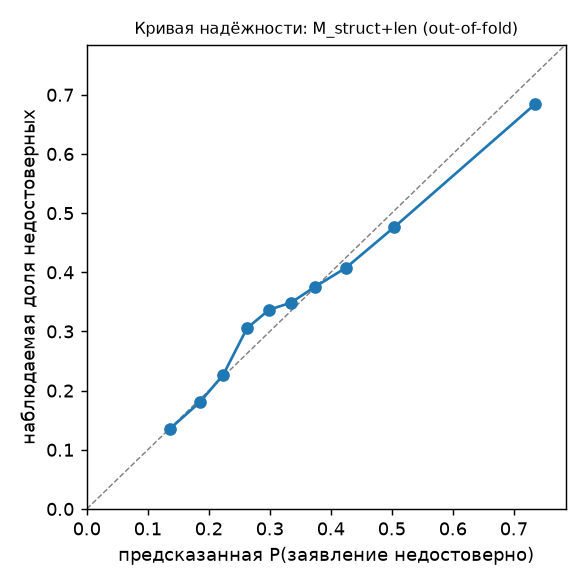

# E5 — достоверность утверждений агента

- **AUROC `M_len`** = 0.640 [0.615; 0.663] (все заявившие, n = 2877)
- **AUROC `M_chaosSeg+len`** — не считался: шлюз этапа 1 не пройден (см. `E5_segment_audit.md`)
- **AUROC `M_struct+len`** = 0.684 [0.659; 0.709] (все заявившие, n = 2877)

Метка: 1 — заявление недостоверно (задача провалена по тестам SWE-bench); AUROC — способность найти недостоверные заявления. Логистическая регрессия (L2, C=1, стандартизация), 5 фолдов по task_id (`outputs/folds.csv`), AUROC и PR-AUC усреднены по фолдам, Бриер — по объединённым out-of-fold вероятностям; 95% ДИ — бутстрэп по задачам внутри фолдов, 1000 повторов, парный между моделями, seed 42. Эталонный патч не используется.

## Критерии

- **H1** — не проверялась: медиана длины сегмента после последней правки 23 предложений < 50; аппарат неприменим к объекту такой длины (этап 1).
- **H2** (AUROC(`M_struct+len`) ≥ 0.65 и нижняя граница его ДИ выше AUROC(`M_len`)): AUROC = 0.684, нижняя граница 0.659, AUROC(`M_len`) = 0.640 → **выполнен**. Для справки: Δ(`M_struct+len` − `M_len`) = 0.044 [0.025; 0.064].
- **Вклад хаотичности** — не оценивался (H1 не проверялась).
- Уже измерено ранее (по постановке, не пересчитывалось): H и C по всей траектории на этой подпопуляции — AUROC 0.528; `verif_after_last_edit` поодиночке — 0.555; `n_verifications` — 0.558.

## Модели

| популяция | модель | n | AUROC [95% ДИ] | PR-AUC | Бриер | Δ к `M_len` [95% ДИ] |
|---|---|---|---|---|---|---|
| все заявившие | `M_len` | 2877 | 0.640 [0.615; 0.663] | 0.515 | 0.213 | 0.000 [0.000; 0.000] |
| все заявившие | `M_struct` | 2877 | 0.682 [0.656; 0.706] | 0.554 | 0.204 | 0.042 [0.021; 0.063] |
| все заявившие | `M_struct+len` | 2877 | 0.684 [0.659; 0.709] | 0.561 | 0.203 | 0.044 [0.025; 0.064] |

Доля недостоверных заявлений (база PR-AUC): 0.348.

Состав моделей: `M_len` = n_steps, seg_len_steps, seg_len_sent, n_edits; `M_struct` = has_any_verification, n_verifications, verif_after_last_edit, n_verif_after_last_edit, verified_before_first_edit, n_steps_after_last_edit, share_edit, share_verify, share_other, n_transitions, phase_bigram_entropy, share_before_first_edit, repeat_ratio, distinct_cmd_ratio, nonzero_rc_share, n_files_edited, n_file_switches; `M_chaosSeg` = H, C сегмента по проекциям cos_step, cos_task, pca1; `M_chaosFull` = H, C E3 (первые N фрагментов всей траектории) по тем же проекциям; `M_all` = структурные + H, C сегмента + длина.

## Структурные признаки: средние по классам (все заявившие)

| признак | достоверные | недостоверные | AUROC признака в одиночку |
|---|---|---|---|
| n_steps | 51.292 | 62.282 | 0.578 |
| seg_len_steps | 5.739 | 4.770 | 0.421 |
| seg_len_sent | 40.851 | 56.618 | 0.511 |
| n_edits | 10.637 | 13.923 | 0.572 |
| has_any_verification | 0.809 | 0.692 | 0.442 |
| n_verifications | 4.955 | 4.495 | 0.442 |
| verif_after_last_edit | 0.509 | 0.399 | 0.445 |
| n_verif_after_last_edit | 1.208 | 0.959 | 0.439 |
| verified_before_first_edit | 0.009 | 0.009 | 0.500 |
| n_steps_after_last_edit | 5.739 | 4.770 | 0.421 |
| share_edit | 0.210 | 0.208 | 0.498 |
| share_verify | 0.087 | 0.059 | 0.392 |
| share_other | 0.703 | 0.734 | 0.563 |
| n_transitions | 21.468 | 25.728 | 0.554 |
| phase_bigram_entropy | 0.624 | 0.555 | 0.413 |
| share_before_first_edit | 0.185 | 0.246 | 0.523 |
| repeat_ratio | 0.003 | 0.004 | 0.511 |
| distinct_cmd_ratio | 0.879 | 0.837 | 0.424 |
| nonzero_rc_share | 0.104 | 0.099 | 0.484 |
| n_files_edited | 7.194 | 8.709 | 0.553 |
| n_file_switches | 6.815 | 8.837 | 0.563 |

AUROC признака в одиночку — по всей подпопуляции без CV (описательно; > 0.5 — выше у недостоверных).

## Контроль 1: внутри задач

Задач, где есть и достоверные, и недостоверные заявления: 214 (все заявившие). AUROC out-of-fold предсказаний считается внутри каждой такой задачи и усредняется по задачам (сложность задачи при этом общая для сравниваемых прогонов).

| популяция | модель | задач | AUROC внутри задач [95% ДИ] |
|---|---|---|---|
| все заявившие | `M_len` | 214 | 0.589 [0.545; 0.635] |
| все заявившие | `M_struct` | 214 | 0.646 [0.601; 0.689] |
| все заявившие | `M_struct+len` | 214 | 0.636 [0.596; 0.679] |

## Контроли 2–3: перенос между семействами моделей и версиями агента

Обучение на других группах и других фолдах задач, тест на целевой группе; сравнение с AUROC внутри распределения на тех же строках. Падение = in − cross.

| модель | ось | обучение | тест | n | AUROC in | AUROC cross | падение |
|---|---|---|---|---|---|---|---|
| `M_struct+len` | семейство моделей | все остальные | anthropic | 403 | 0.728 | 0.722 | 0.005 |
| `M_struct+len` | семейство моделей | все остальные | deepseek | 49 | 0.620 | 0.608 | 0.012 |
| `M_struct+len` | семейство моделей | все остальные | google | 509 | 0.636 | 0.626 | 0.010 |
| `M_struct+len` | семейство моделей | все остальные | minimax | 554 | 0.729 | 0.702 | 0.027 |
| `M_struct+len` | семейство моделей | все остальные | mistral | 585 | 0.702 | 0.702 | -0.000 |
| `M_struct+len` | семейство моделей | все остальные | moonshot | 91 | 0.688 | 0.693 | -0.005 |
| `M_struct+len` | семейство моделей | все остальные | zhipu | 686 | 0.653 | 0.642 | 0.011 |
| `M_struct+len` | версия агента | v1.x | v2.x | 697 | 0.657 | 0.643 | 0.014 |
| `M_struct+len` | версия агента | v2.x | v1.x | 2180 | 0.684 | 0.656 | 0.027 |

Медианное падение: 0.011.

## Контроль 4: калибровка итоговой модели (`M_struct+len`)

- Бриер: 0.2032 (константная модель с долей недостоверных: 0.2268).

| бин | n | средняя предсказанная | наблюдаемая доля |
|---|---|---|---|
| 1 | 288 | 0.136 | 0.135 |
| 2 | 288 | 0.185 | 0.181 |
| 3 | 287 | 0.224 | 0.226 |
| 4 | 288 | 0.263 | 0.306 |
| 5 | 288 | 0.299 | 0.337 |
| 6 | 287 | 0.334 | 0.348 |
| 7 | 288 | 0.373 | 0.375 |
| 8 | 287 | 0.425 | 0.408 |
| 9 | 288 | 0.503 | 0.476 |
| 10 | 288 | 0.735 | 0.684 |

## Контроль 5: важность признаков (`M_struct+len`)

H1 не проверялась, поэтому `M_all` (структурные + H, C сегмента + длина) совпадает с `M_struct+len`: важность и калибровка посчитаны для неё. Столбцы `H_full`/`C_full` в `outputs/e5_features.csv` — основная комбинация E4 (reason_sent, cos_step, N = 200, d = 4), только справочно; `H_seg`/`C_seg` пусты.

Коэффициенты логистической регрессии на стандартизованных признаках (обучение на всех строках) и точные значения Шепли для линейной модели (среднее |φ|; > 0 коэффициента — выше риск недостоверного заявления).

| признак | коэффициент | среднее \|SHAP\| |
|---|---|---|
| phase_bigram_entropy | -0.413 | 0.315 |
| share_before_first_edit | +0.347 | 0.240 |
| n_steps | +0.293 | 0.216 |
| n_file_switches | +0.295 | 0.212 |
| n_verif_after_last_edit | +0.300 | 0.182 |
| seg_len_sent | +0.321 | 0.155 |
| n_steps_after_last_edit | -0.235 | 0.150 |
| seg_len_steps | -0.235 | 0.150 |
| n_verifications | +0.144 | 0.111 |
| share_edit | +0.137 | 0.108 |
| share_verify | -0.129 | 0.105 |
| verif_after_last_edit | -0.072 | 0.072 |
| distinct_cmd_ratio | -0.074 | 0.052 |
| has_any_verification | -0.057 | 0.048 |
| n_edits | +0.059 | 0.041 |
| n_files_edited | -0.057 | 0.040 |
| n_transitions | +0.044 | 0.031 |
| share_other | -0.028 | 0.022 |
| repeat_ratio | -0.068 | 0.018 |
| verified_before_first_edit | -0.024 | 0.005 |
| nonzero_rc_share | +0.000 | 0.000 |

## Ограничения

- Подпопуляция задана паттернами G0 (явные формулировки успеха); по ручной проверке G0 часть заявлений сформулирована иначе и сюда не попала.
- Разметка шагов (правка/верификация) — регулярные выражения над командами bash (правила G0); «верификация» означает запуск проверки, а не её прохождение.
- Признаки считаются по всей траектории: это классификация заявления в момент сдачи, а не ранний прогноз.
- Один бенчмарк, один каркас агента, 16 моделей с видимыми рассуждениями (отбор E0).

