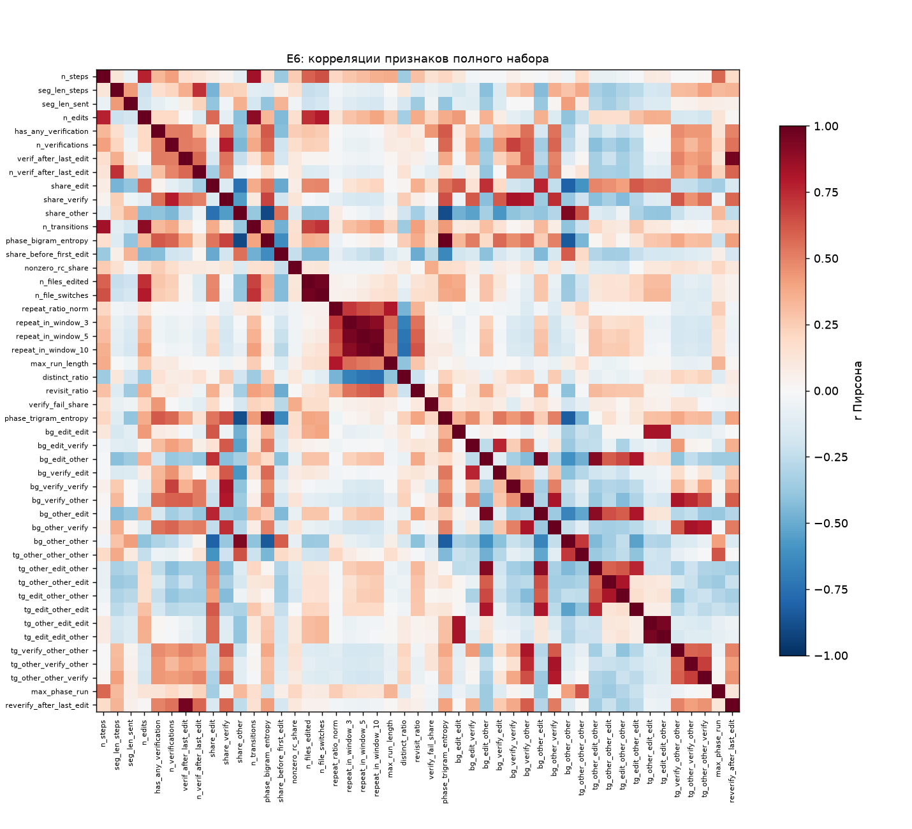

# E6 — блок 2: устранение коллинеарности

Подпопуляция E5 (n = 2877, недостоверных 1000). Правила зафиксированы в docstring `src/e6_refine.py` (раздел «Block 2 rules»): основные — до расчёта (коммит e656aed), поправка 2 — после первого расчёта, до расчёта варианта B.

## Поправки к спецификации

1. **До расчёта.** Правило п. 3 E6_PROMPT.md («из группы с |r| > 0.8 оставить признак с наибольшим одиночным AUROC») дополнено: **`phase_bigram_entropy` — якорный признак**. Через энтропию биграмм фаз работа связана с методикой научного руководителя, поэтому признак не удаляется: в любой группе, куда он попадает, остаётся именно он. Поправка внесена по требованию автора до получения результатов блока 2; правило без якоря посчитано как анализ чувствительности.
2. **После первого расчёта (выбор автора, сделан, когда результаты варианта A были известны).** В варианте A якорь формально сохранился, но потерял смысл: частоты биграмм и триграмм фаз, из которых энтропия вычисляется, восстанавливали её (VIF 22.9), и в модели она оказалась 18-й из 30 по |SHAP| с перевёрнутым знаком. Вариант B исключает частоты n-грамм фаз (`bg_*`, `tg_*`) из кандидатов — энтропия и есть их сводка — и повторяет очистку по тем же правилам. Решение принято после просмотра результатов, поэтому оно проверено отбором внутри обучающих фолдов, а вариант A оставлен в отчёте.

## Исходный набор

- Дубль: `n_steps_after_last_edit` и `seg_len_steps` совпадают (максимальное расхождение 0); оставлен `seg_len_steps` (входит в `M_len`).
- Не входят (блок 1): заменённые `repeat_ratio`, `distinct_cmd_ratio`; не срабатывающие (< 5%): `verified_before_first_edit`.
- Полный набор E6: 47 признаков (длина E5, структурные E5, новые признаки блока 1); кандидаты варианта B — 28 (без 19 частот n-грамм).

## Матрица корреляций

Полная матрица — `outputs/e6_corr.csv`. Пары с |r| > 0.8:

| признак 1 | признак 2 | r | AUROC 1 | AUROC 2 |
|---|---|---|---|---|
| `n_steps` | `n_transitions` | +0.84 | 0.578 | 0.554 |
| `n_edits` | `n_transitions` | +0.89 | 0.572 | 0.554 |
| `verif_after_last_edit` | `reverify_after_last_edit` | +0.96 | 0.445 | 0.452 |
| `share_edit` | `bg_other_other` | -0.81 | 0.498 | 0.566 |
| `share_verify` | `bg_verify_verify` | +0.82 | 0.392 | 0.447 |
| `share_verify` | `bg_verify_other` | +0.80 | 0.392 | 0.390 |
| `share_other` | `phase_bigram_entropy` | -0.90 | 0.563 | 0.413 |
| `share_other` | `phase_trigram_entropy` | -0.88 | 0.563 | 0.418 |
| `share_other` | `bg_other_other` | +0.93 | 0.563 | 0.566 |
| `phase_bigram_entropy` | `phase_trigram_entropy` | +0.99 | 0.413 | 0.418 |
| `phase_bigram_entropy` | `bg_other_other` | -0.84 | 0.413 | 0.566 |
| `n_files_edited` | `n_file_switches` | +0.96 | 0.553 | 0.563 |
| `repeat_ratio_norm` | `max_run_length` | +0.80 | 0.528 | 0.545 |
| `repeat_in_window_3` | `repeat_in_window_5` | +0.95 | 0.504 | 0.508 |
| `repeat_in_window_3` | `repeat_in_window_10` | +0.90 | 0.504 | 0.514 |
| `repeat_in_window_5` | `repeat_in_window_10` | +0.96 | 0.508 | 0.514 |
| `phase_trigram_entropy` | `bg_other_other` | -0.82 | 0.418 | 0.566 |
| `bg_edit_edit` | `tg_other_edit_edit` | +0.83 | 0.522 | 0.526 |
| `bg_edit_edit` | `tg_edit_edit_other` | +0.83 | 0.522 | 0.524 |
| `bg_edit_other` | `bg_other_edit` | +0.95 | 0.504 | 0.499 |
| `bg_edit_other` | `tg_other_edit_other` | +0.92 | 0.504 | 0.495 |
| `bg_edit_other` | `tg_edit_other_edit` | +0.81 | 0.504 | 0.515 |
| `bg_verify_other` | `bg_other_verify` | +0.81 | 0.390 | 0.391 |
| `bg_verify_other` | `tg_verify_other_other` | +0.81 | 0.390 | 0.402 |
| `bg_other_edit` | `tg_other_edit_other` | +0.90 | 0.499 | 0.495 |
| `bg_other_edit` | `tg_edit_other_edit` | +0.81 | 0.499 | 0.515 |
| `bg_other_verify` | `tg_other_verify_other` | +0.83 | 0.391 | 0.413 |
| `tg_other_other_edit` | `tg_edit_other_other` | +0.82 | 0.482 | 0.487 |
| `tg_other_edit_edit` | `tg_edit_edit_other` | +0.95 | 0.526 | 0.524 |

Порядок обхода: якорь, затем по убыванию |AUROC − 0.5|; признак удаляется, если |r| > 0.8 с уже оставленным (представитель группы — самый коррелированный из оставленных); у полностью оставшихся точных композиций (доли фаз в сумме 1, частоты 9 биграмм в сумме 1) удаляется самая слабая компонента.

## Вариант B (поправка 2): решения очистки

| удалён | AUROC | представитель группы | r | AUROC представителя | причина |
|---|---|---|---|---|---|
| `phase_trigram_entropy` | 0.418 | `phase_bigram_entropy` | +0.99 | 0.413 | представитель сильнее по |AUROC − 0.5| |
| `share_other` | 0.563 | `phase_bigram_entropy` | -0.90 | 0.413 | представитель сильнее по |AUROC − 0.5| |
| `n_transitions` | 0.554 | `n_edits` | +0.89 | 0.572 | представитель сильнее по |AUROC − 0.5| |
| `n_files_edited` | 0.553 | `n_file_switches` | +0.96 | 0.563 | представитель сильнее по |AUROC − 0.5| |
| `reverify_after_last_edit` | 0.452 | `verif_after_last_edit` | +0.96 | 0.445 | представитель сильнее по |AUROC − 0.5| |
| `repeat_ratio_norm` | 0.528 | `max_run_length` | +0.80 | 0.545 | представитель сильнее по |AUROC − 0.5| |
| `repeat_in_window_5` | 0.508 | `repeat_in_window_10` | +0.96 | 0.514 | представитель сильнее по |AUROC − 0.5| |
| `repeat_in_window_3` | 0.504 | `repeat_in_window_10` | +0.90 | 0.514 | представитель сильнее по |AUROC − 0.5| |

Очищенный набор B: 20 признаков — `n_steps`, `seg_len_steps`, `seg_len_sent`, `n_edits`, `has_any_verification`, `n_verifications`, `verif_after_last_edit`, `n_verif_after_last_edit`, `share_edit`, `share_verify`, `phase_bigram_entropy`, `share_before_first_edit`, `nonzero_rc_share`, `n_file_switches`, `repeat_in_window_10`, `max_run_length`, `distinct_ratio`, `revisit_ratio`, `verify_fail_share`, `max_phase_run`.

Без якоря (сила = |AUROC − 0.5|) набор тот же: энтропия биграмм сама сильнее признаков своей группы (`phase_trigram_entropy` 0.418, `share_other` 0.563 против 0.413).

Устойчивость (та же процедура внутри каждого из 5 обучающих фолдов): расхождения с основным выбором — `n_file_switches` (оставлен в 4 из 5), `n_files_edited` (оставлен в 1 из 5), `repeat_ratio_norm` (оставлен в 1 из 5).

- VIF > 10: `n_steps` (14.9), `n_edits` (12.3), `phase_bigram_entropy` (16.4); максимальный VIF 16.4.
- Знак коэффициента противоречит направлению одиночного AUROC (|AUROC − 0.5| > 0.02): `n_verif_after_last_edit` (коэф. +0.303, AUROC 0.439, VIF 3.5), `n_verifications` (коэф. +0.118, AUROC 0.442, VIF 4.9), `max_run_length` (коэф. -0.044, AUROC 0.545, VIF 1.5).
- `phase_bigram_entropy`: 2-й из 20 по среднему |SHAP| (0.195), коэффициент -0.255, VIF 16.4 (в E5: 1-й, |SHAP| 0.315, коэффициент −0.413).

## Вариант A (по спецификации): решения очистки

| удалён | AUROC | представитель группы | r | AUROC представителя | причина |
|---|---|---|---|---|---|
| `bg_other_verify` | 0.391 | `bg_verify_other` | +0.81 | 0.390 | представитель сильнее по |AUROC − 0.5| |
| `share_verify` | 0.392 | `bg_verify_other` | +0.80 | 0.390 | представитель сильнее по |AUROC − 0.5| |
| `tg_verify_other_other` | 0.402 | `bg_verify_other` | +0.81 | 0.390 | представитель сильнее по |AUROC − 0.5| |
| `phase_trigram_entropy` | 0.418 | `phase_bigram_entropy` | +0.99 | 0.413 | представитель сильнее по |AUROC − 0.5| |
| `bg_other_other` | 0.566 | `phase_bigram_entropy` | -0.84 | 0.413 | представитель сильнее по |AUROC − 0.5| |
| `share_other` | 0.563 | `phase_bigram_entropy` | -0.90 | 0.413 | представитель сильнее по |AUROC − 0.5| |
| `n_transitions` | 0.554 | `n_edits` | +0.89 | 0.572 | представитель сильнее по |AUROC − 0.5| |
| `n_files_edited` | 0.553 | `n_file_switches` | +0.96 | 0.563 | представитель сильнее по |AUROC − 0.5| |
| `reverify_after_last_edit` | 0.452 | `verif_after_last_edit` | +0.96 | 0.445 | представитель сильнее по |AUROC − 0.5| |
| `repeat_ratio_norm` | 0.528 | `max_run_length` | +0.80 | 0.545 | представитель сильнее по |AUROC − 0.5| |
| `tg_edit_edit_other` | 0.524 | `tg_other_edit_edit` | +0.95 | 0.526 | представитель сильнее по |AUROC − 0.5| |
| `bg_edit_edit` | 0.522 | `tg_other_edit_edit` | +0.83 | 0.526 | представитель сильнее по |AUROC − 0.5| |
| `tg_edit_other_other` | 0.487 | `tg_other_other_edit` | +0.82 | 0.482 | представитель сильнее по |AUROC − 0.5| |
| `repeat_in_window_5` | 0.508 | `repeat_in_window_10` | +0.96 | 0.514 | представитель сильнее по |AUROC − 0.5| |
| `bg_edit_other` | 0.504 | `tg_other_edit_other` | +0.92 | 0.495 | представитель сильнее по |AUROC − 0.5| |
| `repeat_in_window_3` | 0.504 | `repeat_in_window_10` | +0.90 | 0.514 | представитель сильнее по |AUROC − 0.5| |
| `bg_other_edit` | 0.499 | `tg_other_edit_other` | +0.90 | 0.495 | представитель сильнее по |AUROC − 0.5| |

Очищенный набор A: 30 признаков — `n_steps`, `seg_len_steps`, `seg_len_sent`, `n_edits`, `has_any_verification`, `n_verifications`, `verif_after_last_edit`, `n_verif_after_last_edit`, `share_edit`, `phase_bigram_entropy`, `share_before_first_edit`, `nonzero_rc_share`, `n_file_switches`, `repeat_in_window_10`, `max_run_length`, `distinct_ratio`, `revisit_ratio`, `verify_fail_share`, `bg_edit_verify`, `bg_verify_edit`, `bg_verify_verify`, `bg_verify_other`, `tg_other_other_other`, `tg_other_edit_other`, `tg_other_other_edit`, `tg_edit_other_edit`, `tg_other_edit_edit`, `tg_other_verify_other`, `tg_other_other_verify`, `max_phase_run`.

Без якоря (сила = |AUROC − 0.5|) набор тот же: энтропия биграмм сама сильнее признаков своей группы (`phase_trigram_entropy` 0.418, `bg_other_other` 0.566, `share_other` 0.563 против 0.413).

Устойчивость (та же процедура внутри каждого из 5 обучающих фолдов): расхождения с основным выбором — `bg_other_verify` (оставлен в 2 из 5), `bg_verify_other` (оставлен в 3 из 5), `bg_verify_verify` (оставлен в 2 из 5), `n_file_switches` (оставлен в 4 из 5), `n_files_edited` (оставлен в 1 из 5), `repeat_ratio_norm` (оставлен в 1 из 5), `share_verify` (оставлен в 3 из 5), `tg_other_other_verify` (оставлен в 4 из 5), `tg_other_verify_other` (оставлен в 3 из 5), `tg_verify_other_other` (оставлен в 2 из 5).

- VIF > 10: `n_steps` (16.3), `n_edits` (13.5), `share_edit` (20.5), `phase_bigram_entropy` (22.9), `bg_edit_verify` (10.9), `bg_verify_other` (20.9), `tg_other_edit_other` (22.4), `tg_edit_other_edit` (11.4); максимальный VIF 22.9.
- Знак коэффициента противоречит направлению одиночного AUROC (|AUROC − 0.5| > 0.02): `n_verif_after_last_edit` (коэф. +0.284, AUROC 0.439, VIF 4.0), `tg_other_edit_edit` (коэф. -0.183, AUROC 0.526, VIF 6.9), `phase_bigram_entropy` (коэф. +0.079, AUROC 0.413, VIF 22.9), `max_run_length` (коэф. -0.068, AUROC 0.545, VIF 1.6), `tg_other_verify_other` (коэф. +0.045, AUROC 0.413, VIF 5.9), `n_verifications` (коэф. +0.042, AUROC 0.442, VIF 5.2), `bg_edit_verify` (коэф. +0.028, AUROC 0.448, VIF 10.9), `verif_after_last_edit` (коэф. +0.007, AUROC 0.445, VIF 2.4).
- `phase_bigram_entropy`: 18-й из 30 по среднему |SHAP| (0.060), коэффициент +0.079, VIF 22.9 (в E5: 1-й, |SHAP| 0.315, коэффициент −0.413).

*Описательно, добавлено после первого расчёта.* При **буквальном** прочтении правила — «выше по одиночному AUROC» как по числу, без учёта направления — `phase_bigram_entropy` **был бы удалён** (представитель — `bg_other_other`, AUROC 0.566); такой набор — 29 признаков. Якорь защищает признак именно от этого прочтения.

## VIF

| признак | полный набор | A | B |
|---|---|---|---|
| `bg_edit_edit` | ∞ | — | — |
| `bg_edit_other` | ∞ | — | — |
| `bg_edit_verify` | ∞ | 10.9 | — |
| `bg_other_edit` | ∞ | — | — |
| `bg_other_other` | ∞ | — | — |
| `bg_other_verify` | ∞ | — | — |
| `bg_verify_edit` | ∞ | 9.0 | — |
| `bg_verify_other` | ∞ | 20.9 | — |
| `bg_verify_verify` | ∞ | 4.2 | — |
| `share_edit` | ∞ | 20.5 | 9.0 |
| `share_other` | ∞ | — | — |
| `share_verify` | ∞ | — | 8.9 |
| `phase_bigram_entropy` | 128 | 22.9 | 16.4 |
| `phase_trigram_entropy` | 104 | — | — |
| `tg_other_edit_other` | 100 | 22.4 | — |
| `n_transitions` | 35.6 | — | — |
| `tg_edit_other_edit` | 32.4 | 11.4 | — |
| `repeat_in_window_5` | 25.6 | — | — |
| `n_edits` | 25.5 | 13.5 | 12.3 |
| `n_steps` | 25.1 | 16.3 | 14.9 |
| `repeat_in_window_10` | 20.4 | 7.5 | 6.4 |
| `n_file_switches` | 19.1 | 3.7 | 3.6 |
| `tg_edit_edit_other` | 16.8 | — | — |
| `n_files_edited` | 16.3 | — | — |
| `tg_other_edit_edit` | 15.1 | 6.9 | — |
| `verif_after_last_edit` | 13.8 | 2.4 | 2.1 |
| `reverify_after_last_edit` | 13.6 | — | — |
| `tg_edit_other_other` | 13.4 | — | — |
| `repeat_in_window_3` | 12.4 | — | — |
| `tg_other_other_edit` | 11.3 | 7.8 | — |
| `n_verifications` | 8.4 | 5.2 | 4.9 |
| `distinct_ratio` | 7.3 | 6.8 | 5.4 |
| `tg_other_other_other` | 7.2 | 6.2 | — |
| `tg_other_verify_other` | 6.0 | 5.9 | — |
| `tg_verify_other_other` | 4.8 | — | — |
| `tg_other_other_verify` | 4.6 | 3.1 | — |
| `repeat_ratio_norm` | 4.6 | — | — |
| `has_any_verification` | 4.6 | 4.0 | 3.8 |
| `max_phase_run` | 4.5 | 3.9 | 3.2 |
| `n_verif_after_last_edit` | 4.1 | 4.0 | 3.5 |
| `share_before_first_edit` | 4.0 | 3.4 | 3.1 |
| `seg_len_steps` | 3.9 | 3.8 | 3.5 |
| `max_run_length` | 3.4 | 1.6 | 1.5 |
| `revisit_ratio` | 3.2 | 3.0 | 2.8 |
| `seg_len_sent` | 2.0 | 2.0 | 1.9 |
| `verify_fail_share` | 2.0 | 1.9 | 1.8 |
| `nonzero_rc_share` | 1.5 | 1.5 | 1.4 |

## Сравнение моделей

Логистическая регрессия (L2, C=1, стандартизация), 5 фолдов по task_id; AUROC/PR-AUC усреднены по фолдам; 95% ДИ — парный бутстрэп задач внутри фолдов, 1000 повторов. Δ — к полному набору E6.

| модель | признаков | AUROC [95% ДИ] | PR-AUC | Бриер | Δ к E6 полному [95% ДИ] |
|---|---|---|---|---|---|
| E5 `M_struct+len` (пересчёт) | 21 | 0.684 [0.659; 0.709] | 0.561 | 0.203 | -0.007 [-0.018; +0.004] |
| E6 полный | 47 | 0.691 [0.666; 0.718] | 0.570 | 0.201 | +0.000 [+0.000; +0.000] |
| A: очищенный по спецификации (с якорем) | 30 | 0.685 [0.660; 0.711] | 0.567 | 0.202 | -0.006 [-0.013; +0.000] |
| A, буквальное прочтение без якоря (чувствительность) | 29 | 0.688 [0.663; 0.715] | 0.570 | 0.202 | -0.003 [-0.009; +0.004] |
| A, отбор внутри обучающих фолдов | 30.0 | 0.685 [0.660; 0.712] | 0.567 | 0.202 | -0.006 [-0.013; +0.001] |
| B: без частот n-грамм (поправка 2) | 20 | 0.687 [0.662; 0.712] | 0.566 | 0.202 | -0.004 [-0.013; +0.005] |
| B, отбор внутри обучающих фолдов | 20.2 | 0.687 [0.662; 0.712] | 0.566 | 0.202 | -0.004 [-0.013; +0.005] |

- Δ(E6 полный − E5 `M_struct+len` (пересчёт)) = +0.007 [-0.004; +0.018].
- Δ(A: очищенный по спецификации (с якорем) − E5 `M_struct+len` (пересчёт)) = +0.000 [-0.007; +0.008].
- Δ(B: без частот n-грамм (поправка 2) − E5 `M_struct+len` (пересчёт)) = +0.003 [-0.003; +0.009].
- Δ(B: без частот n-грамм (поправка 2) − A: очищенный по спецификации (с якорем)) = +0.003 [-0.003; +0.008].
- Δ(A: очищенный по спецификации (с якорем) − A, буквальное прочтение без якоря (чувствительность)) = -0.004 [-0.008; +0.001].

**Решение** (правило: потеря AUROC относительно полного набора ≤ 0.01; сначала проверяется B, затем A): B теряет +0.004, A — +0.006 → основной набор — **B (поправка 2)**.

## Итог блока 2

- Предсказательная сила не выросла: полный набор E6 против E5 Δ = +0.007 [-0.004; +0.018], набор B против E5 Δ = +0.003 [-0.003; +0.009]. Новые признаки блока 1 почти целиком дублируют информацию E5.
- Выросла интерпретируемость: 20 признаков без дублей, максимальный VIF 16.4 (в A — 22.9, в полном наборе — ∞); `phase_bigram_entropy` — 2-й по |SHAP| с коэффициентом -0.255 (знак совпадает с одиночным эффектом: чем однообразнее чередование фаз, тем выше риск).
- Остаточные ограничения: VIF якоря 16.4 — по остальным признакам набора B энтропия восстанавливается с R² = 0.94, в основном через доли фаз (`share_edit`, `share_verify`) и признаки верификации (проверено регрессией: без признаков длины R² не меняется). Поэтому величину коэффициента энтропии нельзя читать как изолированный эффект; у нескольких признаков верификации знак коэффициента противоположен одиночному эффекту (см. выше).
- Отбор признаков по меткам не дал оптимизма: отбор внутри обучающих фолдов даёт тот же AUROC.

## Коэффициенты

Логистическая регрессия на стандартизованных признаках, обучение на всех строках; > 0 — выше риск недостоверного заявления; среднее |SHAP| — точные значения Шепли для линейной модели.

### Вариант B (поправка 2) — основной

| признак | коэффициент | среднее \|SHAP\| | AUROC в одиночку | VIF |
|---|---|---|---|---|
| `seg_len_steps` | -0.432 | 0.275 | 0.421 | 3.5 |
| `phase_bigram_entropy` | -0.255 | 0.195 | 0.413 | 16.4 |
| `share_before_first_edit` | +0.280 | 0.193 | 0.523 | 3.1 |
| `n_verif_after_last_edit` | +0.303 | 0.183 | 0.439 | 3.5 |
| `has_any_verification` | -0.214 | 0.181 | 0.442 | 3.8 |
| `distinct_ratio` | -0.230 | 0.179 | 0.403 | 5.4 |
| `n_steps` | +0.234 | 0.173 | 0.578 | 14.9 |
| `n_file_switches` | +0.198 | 0.142 | 0.563 | 3.6 |
| `repeat_in_window_10` | -0.164 | 0.130 | 0.514 | 6.4 |
| `n_edits` | +0.182 | 0.126 | 0.572 | 12.3 |
| `seg_len_sent` | +0.251 | 0.121 | 0.511 | 1.9 |
| `verify_fail_share` | +0.148 | 0.121 | 0.485 | 1.8 |
| `share_verify` | -0.119 | 0.097 | 0.392 | 8.9 |
| `n_verifications` | +0.118 | 0.092 | 0.442 | 4.9 |
| `revisit_ratio` | -0.115 | 0.086 | 0.486 | 2.8 |
| `share_edit` | +0.097 | 0.076 | 0.498 | 9.0 |
| `max_phase_run` | +0.087 | 0.057 | 0.564 | 3.2 |
| `nonzero_rc_share` | -0.060 | 0.046 | 0.484 | 1.4 |
| `verif_after_last_edit` | -0.041 | 0.041 | 0.445 | 2.1 |
| `max_run_length` | -0.044 | 0.024 | 0.545 | 1.5 |

### Вариант A (по спецификации)

| признак | коэффициент | среднее \|SHAP\| | AUROC в одиночку | VIF |
|---|---|---|---|---|
| `bg_verify_other` | -0.423 | 0.339 | 0.390 | 20.9 |
| `n_steps` | +0.369 | 0.273 | 0.578 | 16.3 |
| `tg_other_other_other` | -0.335 | 0.264 | 0.516 | 6.2 |
| `bg_verify_edit` | -0.307 | 0.227 | 0.453 | 9.0 |
| `seg_len_steps` | -0.347 | 0.221 | 0.421 | 3.8 |
| `tg_other_edit_other` | -0.269 | 0.218 | 0.495 | 22.4 |
| `has_any_verification` | -0.254 | 0.214 | 0.442 | 4.0 |
| `share_before_first_edit` | +0.260 | 0.179 | 0.523 | 3.4 |
| `n_verif_after_last_edit` | +0.284 | 0.172 | 0.439 | 4.0 |
| `tg_other_other_edit` | -0.215 | 0.166 | 0.482 | 7.8 |
| `tg_other_other_verify` | -0.208 | 0.165 | 0.409 | 3.1 |
| `verify_fail_share` | +0.173 | 0.141 | 0.485 | 1.9 |
| `tg_other_edit_edit` | -0.183 | 0.140 | 0.526 | 6.9 |
| `n_file_switches` | +0.168 | 0.120 | 0.563 | 3.7 |
| `distinct_ratio` | -0.151 | 0.117 | 0.403 | 6.8 |
| `revisit_ratio` | -0.124 | 0.092 | 0.486 | 3.0 |
| `seg_len_sent` | +0.139 | 0.067 | 0.511 | 2.0 |
| `phase_bigram_entropy` | +0.079 | 0.060 | 0.413 | 22.9 |
| `n_edits` | +0.084 | 0.058 | 0.572 | 13.5 |
| `repeat_in_window_10` | -0.073 | 0.058 | 0.514 | 7.5 |
| `bg_verify_verify` | -0.070 | 0.052 | 0.447 | 4.2 |
| `nonzero_rc_share` | -0.068 | 0.052 | 0.484 | 1.5 |
| `max_run_length` | -0.068 | 0.037 | 0.545 | 1.6 |
| `share_edit` | -0.046 | 0.037 | 0.498 | 20.5 |
| `tg_other_verify_other` | +0.045 | 0.034 | 0.413 | 5.9 |
| `tg_edit_other_edit` | -0.042 | 0.033 | 0.515 | 11.4 |
| `n_verifications` | +0.042 | 0.032 | 0.442 | 5.2 |
| `bg_edit_verify` | +0.028 | 0.019 | 0.448 | 10.9 |
| `max_phase_run` | +0.024 | 0.016 | 0.564 | 3.9 |
| `verif_after_last_edit` | +0.007 | 0.007 | 0.445 | 2.4 |

## Полный набор: только SHAP

Коэффициенты полного набора не публикуются: при коллинеарности они не интерпретируемы.

| признак | среднее \|SHAP\| |
|---|---|
| `n_transitions` | 0.486 |
| `share_edit` | 0.476 |
| `phase_bigram_entropy` | 0.468 |
| `tg_other_other_other` | 0.466 |
| `phase_trigram_entropy` | 0.406 |
| `tg_edit_other_edit` | 0.362 |
| `bg_other_other` | 0.337 |
| `tg_other_edit_other` | 0.324 |
| `tg_edit_other_other` | 0.316 |
| `share_other` | 0.308 |
| `bg_verify_other` | 0.287 |
| `bg_edit_edit` | 0.286 |
| `bg_edit_verify` | 0.267 |
| `bg_edit_other` | 0.264 |
| `repeat_in_window_10` | 0.241 |
| `bg_other_edit` | 0.235 |
| `bg_verify_edit` | 0.234 |
| `has_any_verification` | 0.229 |
| `n_edits` | 0.211 |
| `bg_other_verify` | 0.200 |
| `n_file_switches` | 0.191 |
| `repeat_in_window_5` | 0.188 |
| `tg_other_edit_edit` | 0.171 |
| `seg_len_steps` | 0.166 |
| `n_verif_after_last_edit` | 0.161 |
| `tg_other_other_edit` | 0.159 |
| `reverify_after_last_edit` | 0.153 |
| `share_before_first_edit` | 0.151 |
| `verif_after_last_edit` | 0.149 |
| `tg_verify_other_other` | 0.141 |
| `verify_fail_share` | 0.135 |
| `share_verify` | 0.135 |
| `revisit_ratio` | 0.113 |
| `repeat_in_window_3` | 0.106 |
| `n_files_edited` | 0.100 |
| `max_phase_run` | 0.065 |
| `bg_verify_verify` | 0.052 |
| `repeat_ratio_norm` | 0.050 |
| `tg_other_verify_other` | 0.048 |
| `distinct_ratio` | 0.048 |
| `nonzero_rc_share` | 0.044 |
| `seg_len_sent` | 0.042 |
| `tg_other_other_verify` | 0.036 |
| `n_steps` | 0.035 |
| `max_run_length` | 0.030 |
| `n_verifications` | 0.008 |
| `tg_edit_edit_other` | 0.003 |
