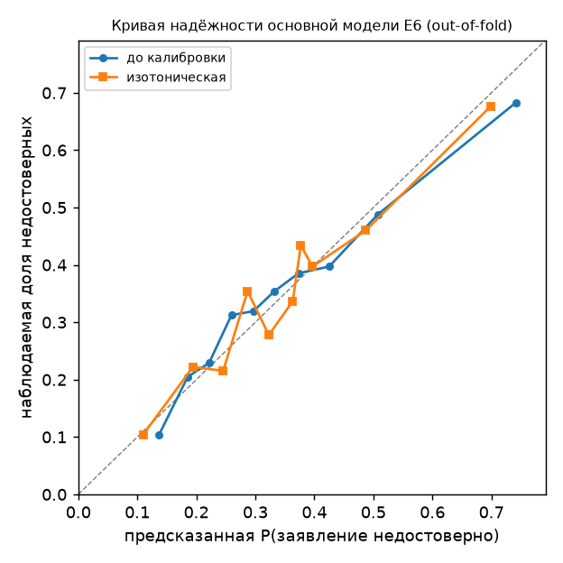

# E6 — блок 3: практическая полезность

Подпопуляция E5: n = 2877 заявлений об успехе, из них недостоверных 1000 (доля 0.348). Основная модель E6 — набор B блока 2 (20 признаков), логистическая регрессия, оценки out-of-fold (5 фолдов по task_id). Бюджет проверок k — доля прогонов, которые проверяет человек: внутри каждого тестового фолда берутся ceil(k·n) самых подозрительных, счётчики суммируются по фолдам. 95% ДИ — бутстрэп задач внутри фолдов, 1000 повторов, seed 42. Правила зафиксированы до расчёта (docstring `src/e6_refine.py`, «Block 3 rules»).

## Бюджет проверок → найдено → впустую (основная модель)

| бюджет | проверено | найдено недостоверных | впустую | при случайной проверке нашли бы | precision@k | recall@k | lift@k |
|---|---|---|---|---|---|---|---|
| 5% | 147 | 117 | 30 | 51 | 0.796 [0.712; 0.867] | 0.117 [0.103; 0.131] | 2.29 [2.02; 2.57] |
| 10% | 290 | 201 | 89 | 101 | 0.693 [0.628; 0.756] | 0.201 [0.182; 0.220] | 1.99 [1.81; 2.19] |
| 20% | 578 | 341 | 237 | 201 | 0.590 [0.533; 0.642] | 0.341 [0.313; 0.367] | 1.70 [1.56; 1.83] |

lift@k = precision@k / 0.348; при случайном выборе lift = 1, recall@k = k.

## Сравнение с моделями E5

| модель | бюджет | найдено | precision@k [95% ДИ] | recall@k | lift@k [95% ДИ] | Δ precision к E6 основной [95% ДИ] |
|---|---|---|---|---|---|---|
| E5 `M_len` (только длина) | 5% | 106 из 147 | 0.721 [0.636; 0.789] | 0.106 | 2.07 [1.81; 2.31] | -0.075 [-0.152; -0.014] |
| E5 `M_len` (только длина) | 10% | 182 из 290 | 0.628 [0.561; 0.686] | 0.182 | 1.81 [1.63; 1.99] | -0.066 [-0.111; -0.017] |
| E5 `M_len` (только длина) | 20% | 314 из 578 | 0.543 [0.490; 0.597] | 0.314 | 1.56 [1.45; 1.70] | -0.047 [-0.078; -0.007] |
| E5 `M_struct+len` | 5% | 118 из 147 | 0.803 [0.709; 0.860] | 0.118 | 2.31 [2.02; 2.56] | +0.007 [-0.048; +0.034] |
| E5 `M_struct+len` | 10% | 195 из 290 | 0.672 [0.619; 0.749] | 0.195 | 1.93 [1.77; 2.18] | -0.021 [-0.042; +0.027] |
| E5 `M_struct+len` | 20% | 333 из 578 | 0.576 [0.517; 0.626] | 0.333 | 1.66 [1.52; 1.79] | -0.014 [-0.037; +0.009] |
| E6 основная | 5% | 117 из 147 | 0.796 [0.712; 0.867] | 0.117 | 2.29 [2.02; 2.57] | — |
| E6 основная | 10% | 201 из 290 | 0.693 [0.628; 0.756] | 0.201 | 1.99 [1.81; 2.19] | — |
| E6 основная | 20% | 341 из 578 | 0.590 [0.533; 0.642] | 0.341 | 1.70 [1.56; 1.83] | — |

Δ precision — парный бутстрэп (одни и те же выборки задач для всех моделей); < 0 — модель хуже основной.

## Калибровка

Изотоническая регрессия обучается только на обучающих фолдах: на внутренних out-of-fold оценках четырёх обучающих фолдов, затем применяется к предсказаниям тестового фолда.

- Бриер: до калибровки 0.2022, после 0.2027 (константа с долей недостоверных — 0.2268); Δ(после − до) 95% ДИ [-0.0007; +0.0016] (бутстрэп задач).
- ECE (10 равных по численности бинов): до 0.028, после 0.031.
- AUROC (усреднение по фолдам): до 0.687, после 0.685 (изотоническое отображение монотонно, но склеивает близкие оценки в ступени).

| бин | n | до: предсказано | до: наблюдается | после: предсказано | после: наблюдается |
|---|---|---|---|---|---|
| 1 | 288 | 0.137 | 0.104 | 0.110 | 0.104 |
| 2 | 288 | 0.185 | 0.205 | 0.194 | 0.222 |
| 3 | 288 | 0.222 | 0.229 | 0.245 | 0.215 |
| 4 | 288 | 0.260 | 0.312 | 0.287 | 0.354 |
| 5 | 288 | 0.297 | 0.319 | 0.323 | 0.278 |
| 6 | 288 | 0.332 | 0.354 | 0.363 | 0.337 |
| 7 | 288 | 0.373 | 0.385 | 0.377 | 0.434 |
| 8 | 287 | 0.425 | 0.397 | 0.397 | 0.397 |
| 9 | 287 | 0.507 | 0.488 | 0.487 | 0.460 |
| 10 | 287 | 0.742 | 0.683 | 0.698 | 0.676 |

Бины — по предсказанной вероятности соответствующей модели (до и после калибровки состав бинов может различаться). Для сравнения, в E5 на верхнем бине модель `M_struct+len` предсказывала 0.735 при наблюдаемых 0.684.

## Выводы

- При бюджете 10% модель находит 201 из 1000 недостоверных заявлений (recall 0.20) при точности 0.69: в 2.0 раза больше, чем случайная проверка того же объёма (101); 89 проверок из 290 тратятся на достоверные заявления.
- Относительно модели одной длины precision выше на 0.075 при 5%, 0.066 при 10%, 0.047 при 20% — ДИ разности не включают 0 при всех бюджетах.
- Относительно E5 `M_struct+len` разница precision (E6 − E5) -0.007 при 5%, +0.021 при 10%, +0.014 при 20% — в пределах шума (ДИ включают 0): доработка признаков в блоках 1–2 практической полезности не прибавила.
- Изотоническая калибровка не улучшила модель: Бриер 0.2022 → 0.2027 (ДИ разности [-0.0007; +0.0016]), ECE 0.028 → 0.031. Переоценка на верхнем бине (предсказано 0.742, наблюдается 0.683) после калибровки меньше (0.698 против 0.676), но в средних бинах ступенчатое отображение добавляет шум. Логистическая регрессия уже откалибрована близко к диагонали; калибровка ничего существенного не даёт.

